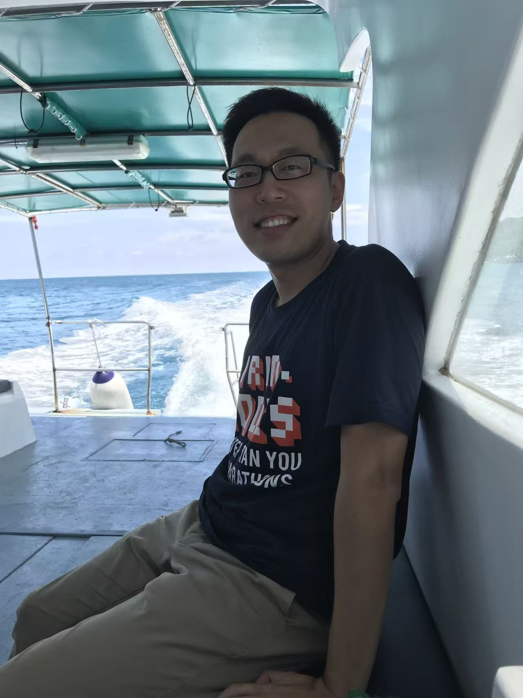
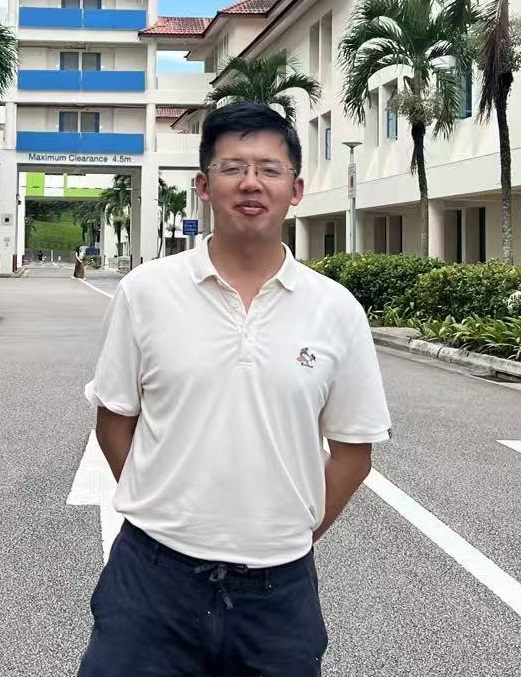
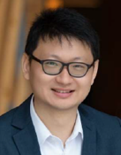
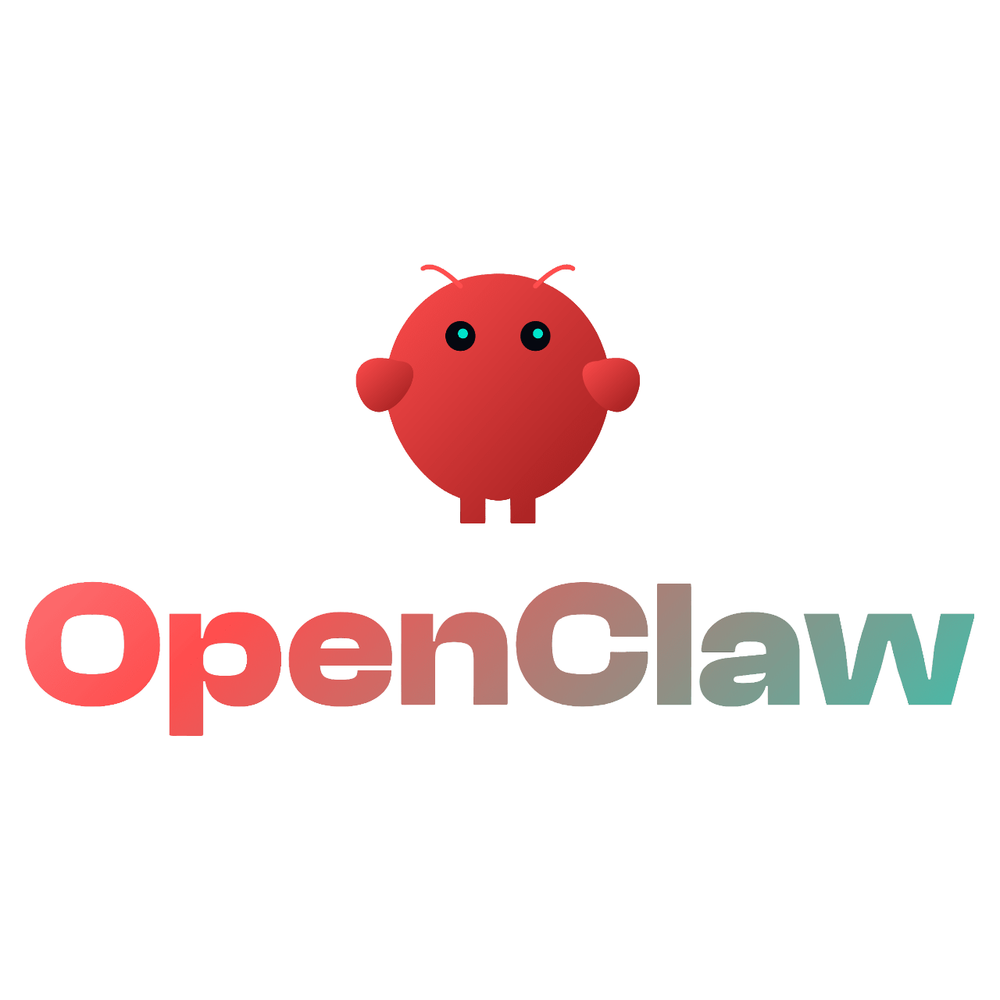
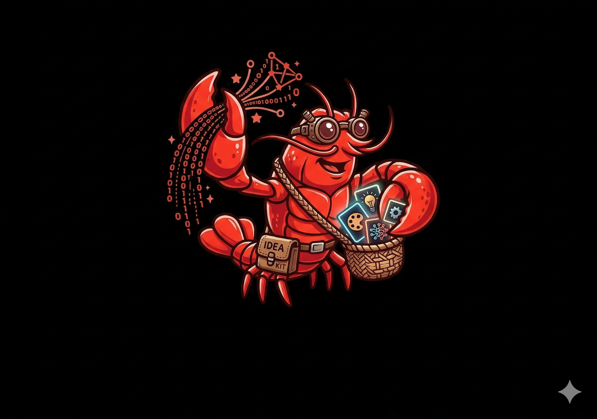
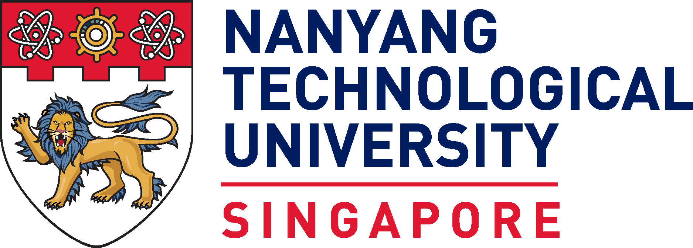
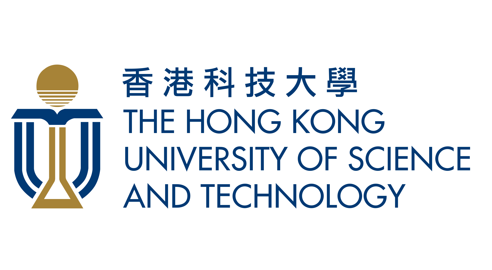

---
hide:
  - navigation
  - toc
---

# About AIone Lab

AIone Lab is a summary of our past project history and our ongoing R&D activities. We provide a range of specialized services, including the end-to-end deployment of everything showcased on this site—from the platform itself to the full commercialization of its underlying technologies—into your organization's daily operations. We invite you to contact us with your most challenging objectives; we believe that as long as a request does not violate the physical laws of our universe, we can engineer a viable solution.

---

## What We Do

### 🤖 Intelligent Automation

We design and deploy **n8n-based workflow hubs** that connect large language models, APIs, and business tools — running 24/7 without human intervention. From AI-powered selfie booths to automated student grading systems, our workflows solve real operational problems.

### 🔧 Hardware × AI Integration

From **Raspberry Pi** edge devices to **ESP32** embedded interfaces, we prototype controllers that respond to AI decisions in the physical world. Our projects span OLED-based productivity timers, robotic arms, and quadruped robots — all with working code and schematics.

### 🎓 Applied AI Education

Case-study-driven tutorials covering **vibe coding**, AIGC prompt engineering, and end-to-end automation. Every concept comes with a live demo, working code, or a hands-on build guide — designed for practitioners, not theorists.

---

## Our Approach

We take a **build-first** approach: every concept on this site ships with working code, hardware schematics, or a live demo. We believe the fastest way to understand AI's potential is to see it run — in a workflow, on a screen, or controlling a robot arm.

---

## Built With

`n8n` · `Python` · `ESP32` · `Raspberry Pi` · `Docker` · `MkDocs` · `OpenAI API`

---

Explore our [Projects](projects/vibe-coding.md) to see what we're building, or [get in touch](contact.md) if you'd like to collaborate.

---

## Our Team

  

    

      

        
      

      <h3 class="bento-title">Dr Miao Bin</h3>
      
Chief AI Officer (CAIO)

      
Dr. Miao is the visionary leader driving enterprise-wide AI transformation. He specializes in deploying state-of-the-art AI algorithms to revitalize traditional applications, bridging the gap between cutting-edge research and scalable business impact. Operating at the technological forefront, he continuously explores how native AI applications can architect intelligent ecosystems and revolutionize a myriad of industries.

    

  

  

    

      

        
      

      <h3 class="bento-title">Dr Deng Zhihua</h3>
      
AI Engineer

      
Dr. Deng is the cyber-physical virtuoso orchestrating the synaptic fusion of neural networks and edge hardware. He focuses on deploying highly optimized AI algorithms directly onto localized endpoints, powering next-generation energy management systems, advanced robotics, and real-time computer vision platforms. By turning raw silicon into autonomously intelligent endpoints, he pushes the ultimate boundaries of embedded AI and operational limits.

    

  

  

    

      

        
      

      <h3 class="bento-title">Yang Xun</h3>
      
Hardware Engineer

      
With over 15 years of veteran expertise in hardware engineering, Yang is the absolute bedrock of our physical implementations. He spearheads all hardware-related operations, ranging from intricate PCB topographies and rapid physical prototyping to robust electro-mechanical integrations. By flawlessly executing the tangible builds, he transforms our cutting-edge digital intelligence into battle-tested, real-world machineries.

    

  

  

    

      

        
      

      <h3 class="bento-title">Charles Sun</h3>
      
Software Engineer

      
Charles is an experienced software engineer with a decade of expertise in full-stack development. His responsibilities encompass software UI development, API integration, and the deployment of control algorithms. By meticulously weaving scalable API pipelines with elegant frontends, he architects intuitive human-in-the-loop portals that make our advanced cognitive engines accessible and resilient.

    

  

  

    

      

        
      

      <h3 class="bento-title">Original Claw</h3>
      
Operations Secretary (Non-Human)

      
As the tireless backbone of our daily operations, Original Claw handles the heavy lifting of administrative work. Its core functionalities encompass rapid, high-accuracy document recognition, automated data entry, and seamless frontline customer service. By executing these essential tasks efficiently, it ensures the human team remains unburdened and strictly focused on innovation.

    

  

  

    

      

        
      

      <h3 class="bento-title">Scout-Claw</h3>
      
Explorer (Non-Human)

      
Scout-Claw operates on pure, unadulterated curiosity. It relentlessly crawls the digital tides—from obscure GitHub repos to underground creative forums—scavenging for "Biological Sparks" (new ideas) and "Digital Driftwood" (emerging trends). Its primary task is to filter this raw data into structured "Catalyst Briefs" for the human team to dissect during R&D sessions.

    

  

  <a href="https://chem.hkust.edu.hk/people/haibin-su-suhaibin" target="_blank" rel="noopener noreferrer" class="bento-card">
    

      

        
      

      <h3 class="bento-title">Prof Su Haibin</h3>
      
Academic Advisor

      
Full Professor at HKUST and Director of the IAS Center for AI for Scientific Discoveries. Specializing in Quantum Physics, Computational Chemistry, and Applied AI. Prof. Su acts as our visionary architect bridging academia and the tech industry. By translating paradigm-shifting scientific research into scalable, industry-disrupting technology, he provides unparalleled guidance on frontier trends and ensures our moonshot R&D initiatives are infused with absolute, bleeding-edge rigor.

    

  </a>

## Partners

  

    

      

        
      

      <h3 class="bento-title">Nanyang Technological University (NTU)</h3>
      
Ranked #1 globally for Artificial Intelligence. Leading interdisciplinary research in Robotics, NLP, Computer Vision, and "AI for X" applications.

    

  

  

    

      

        
      

      <h3 class="bento-title">Hong Kong University of Science and Technology (HKUST)</h3>
      
A premier AI hub pioneering innovations in Healthcare AI, Generative AI models (HKGAI), and driving impactful "AI + X" solutions across diverse sectors.

    

  

  <a href="https://laviebay.wixsite.com/soiree" target="_blank" rel="noopener noreferrer" class="bento-card">
    

      

        
      

      <h3 class="bento-title">Society of Interdisciplinary Research</h3>
      
SOIRÉE is a premier international platform that fosters interdisciplinary collaboration by boldly bridging the gap between cutting-edge scientific research and commercial applications to solve the grand challenges of the 21st century.

    

  </a>

