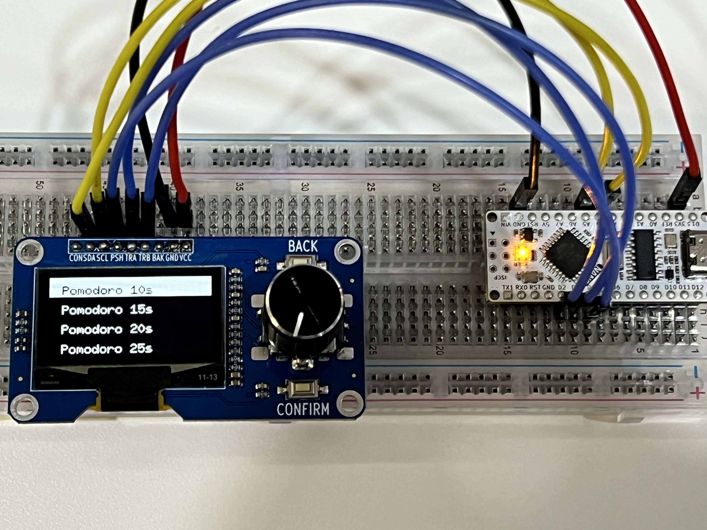
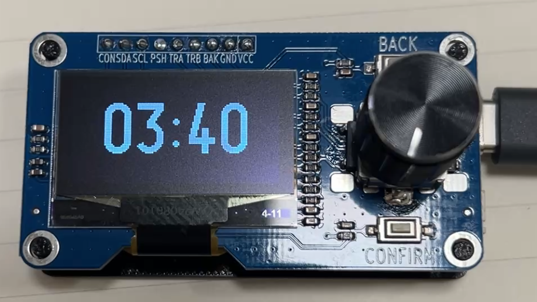
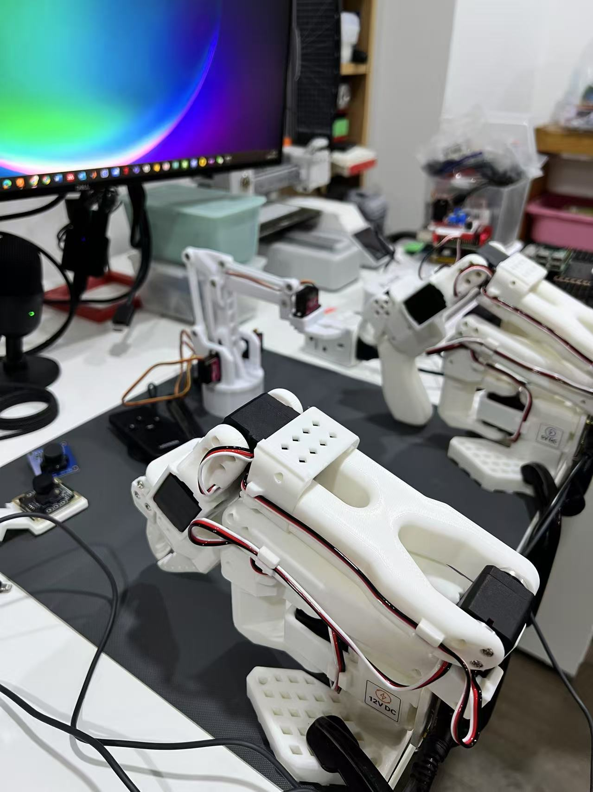
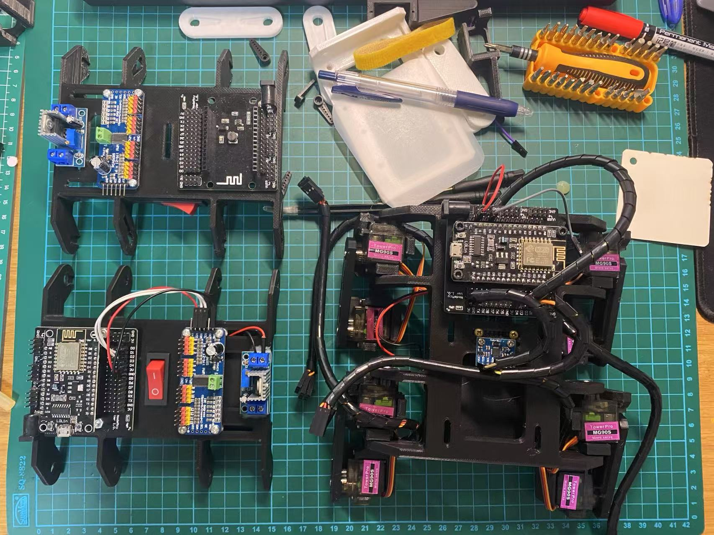
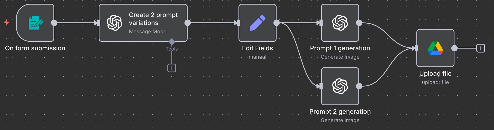
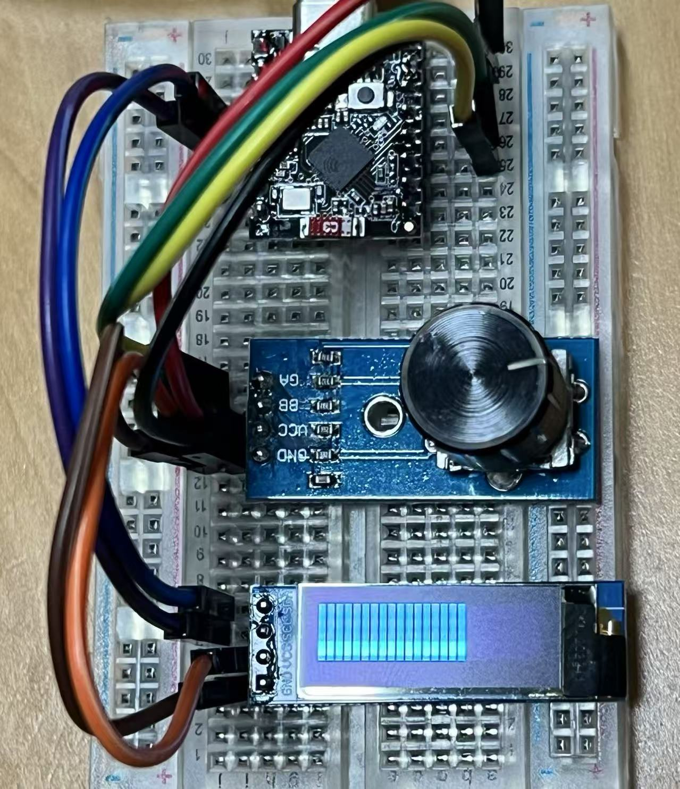

# Welcome to AIplay

Explore some of my projects:

  

    <a href="projects/screen-project/timer">
      
      <strong>Screen Project</strong>
    </a>
  

  

    <a href="projects/screen-project/pomodo_timer_V4">
      
      <strong>Pomodo with case</strong>
    </a>
  

  

    <a href="projects/raspberrypi-project/raspberrypi-page">
      
      <strong>Raspberry Pi Integration</strong>
    </a>
  

  

    <a href="projects/lerobot">
       
      
<strong>LeRobot</strong>

    </a>
  

  

    <a href="projects/quadruped">
      
      <strong>Quadruped</strong>
    </a>
  

  

    <a href="projects/screen-project/timer_091OLED_V3">
      
      <strong>Pomodo</strong>
    </a>
  

  

    <a href="projects/ai-course">
      
      <strong>AI Agent Course</strong>
    </a>
  

  

    <a href="projects/screen-project/timer_091OLED">
      
      <strong>Pomodoro 0.91 OLED</strong>
    </a>
  

  

    <a href="projects/vibe-coding">
      
      <strong>Vibe Coding</strong>
    </a>
  

