---
hide:
  - navigation
  - toc
---

  <section class="hero-section">
    

      

        
Alone Lab

        <h1 class="hero-title">
          AI for 
          real operations
        </h1>
        

          We design practical AI tools, automation workflows, and embedded systems that turn daily work into repeatable, usable products.
        

      

      

        <a href="projects/local-rag" class="hero-mini-card">
          

            
          

          Knowledge AI
          <h3 class="hero-mini-title">Private Local RAG</h3>
          
Secure document querying and retrieval workflows for internal knowledge systems.

        </a>

        <a href="projects/hermes-agent-raspberry-pi-4b-voice-setup" class="hero-mini-card">
          

            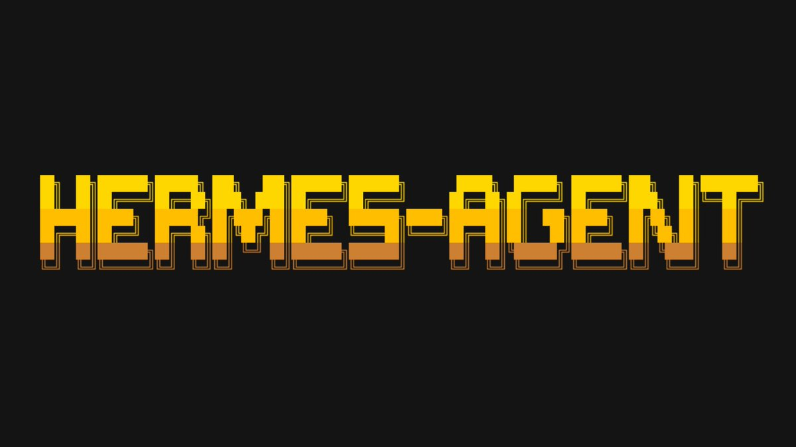
          

          Voice AI
          <h3 class="hero-mini-title">Hermes Voice Agent</h3>
          
Real-time speech workflows with STT, LLM orchestration, and TTS on low-cost hardware.

        </a>

        <a href="projects/raspberry-pi-5-tank-stack-chan" class="hero-mini-card">
          

            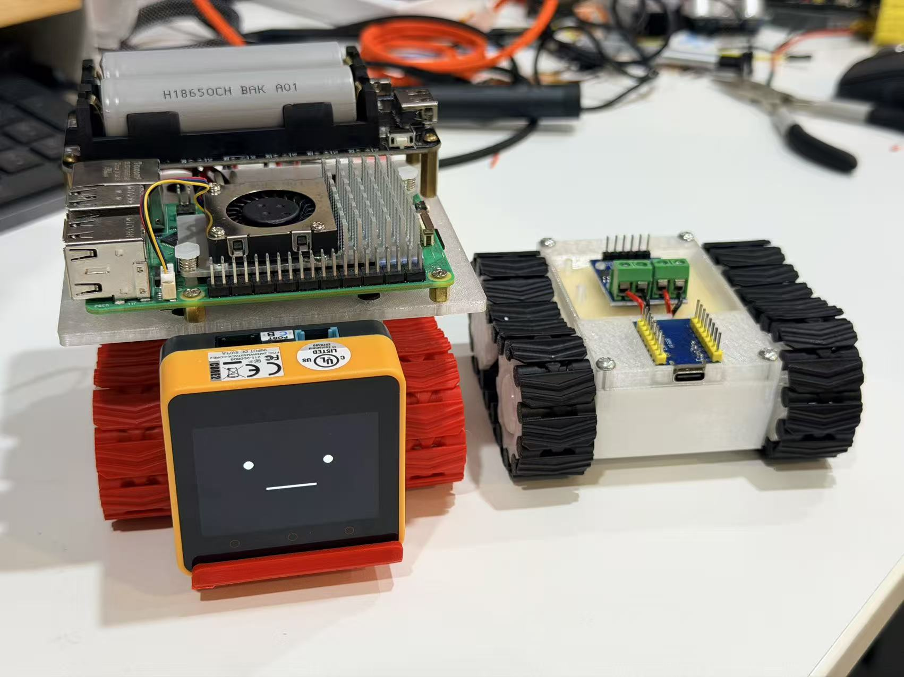
          

          Companion AI
          <h3 class="hero-mini-title">M5Stack Chan Robot</h3>
          
A mobile LLM companion with expressions, voice interaction, memory, and private AI expansion.

        </a>

        <a href="projects/cloudflare-worker-backend" class="hero-mini-card">
          

            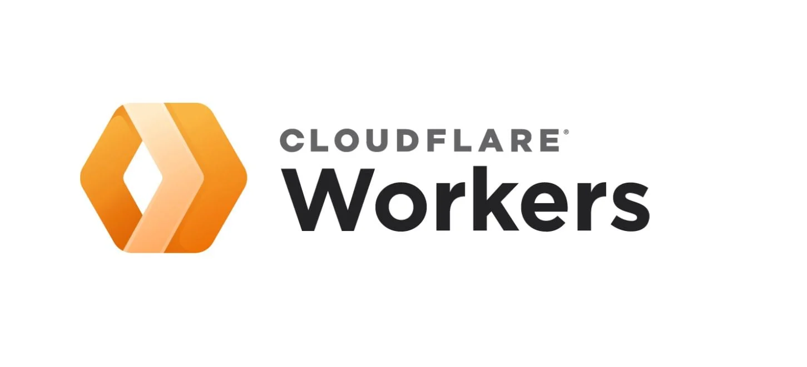
          

          Automation
          <h3 class="hero-mini-title">Cloudflare Backend</h3>
          
Serverless foundations for API routing, protected keys, and deployable AI app backends.

        </a>
      

    

  </section>

  

    <a href="projects/ai-agent-terminal" class="bento-card">
      

        AI Terminal
        <h3 class="bento-title">AI Agent Terminal</h3>
        
An all-in-one voice AI terminal connected to cloud or local large models for coding and log organization.

        

          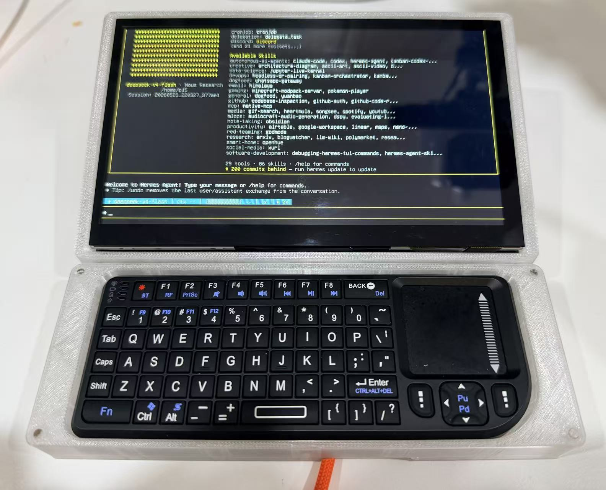
        

      

    </a>

    <a href="projects/hermes-agent-voice-mode" class="bento-card">
      

        Voice AI
        <h3 class="bento-title">Hermes Agent Voice Mode</h3>
        
Step-by-step macOS setup to add real-time STT and TTS voice interaction to Hermes Agent.

        

          
        

      

    </a>

    <a href="projects/github-pages-mkdocs" class="bento-card">
      

        Tutorial
        <h3 class="bento-title">Github Pages</h3>
        
Deploy a MkDocs static site on GitHub Pages and let an AI Agent manage the content autonomously.

        

          
        

      

    </a>

    <a href="projects/ai-knowledge-wiki" class="bento-card">
      

        Knowledge
        <h3 class="bento-title">AI Knowledge Wiki</h3>
        
Let an AI Agent manage your personal Obsidian knowledge base — ingest, query, and maintain your second brain automatically.

        

          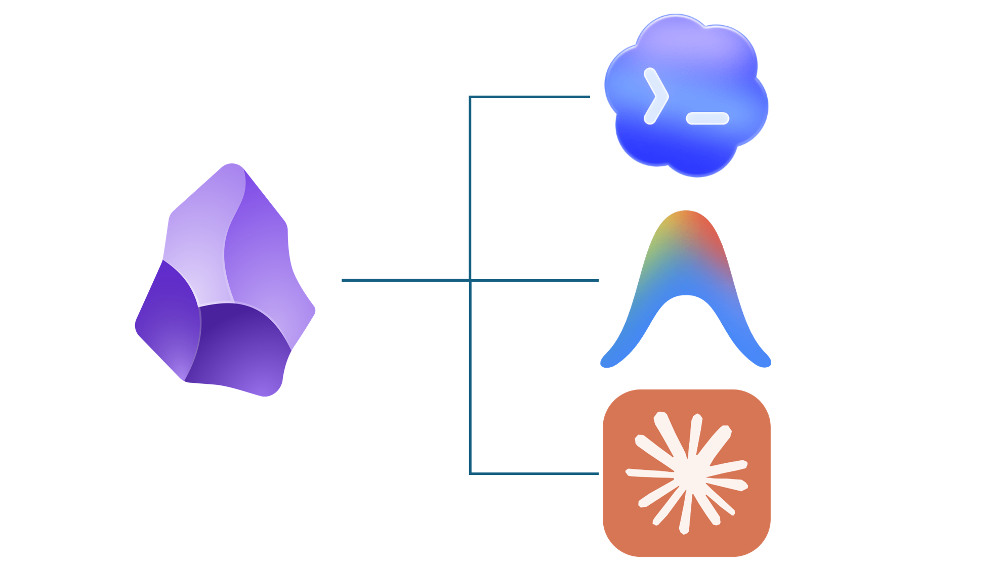
        

      

    </a>

    <a href="aigc-prompt" class="bento-card">
      

        AIGC
        <h3 class="bento-title">AIGC Prompt Gallery</h3>
        
Curated collection of AI-generated content prompts with full images and copyable prompts.

        

          
        

      

    </a>

    <a href="projects/notebooklm-tutorial" class="bento-card">
      

        Tutorial
        <h3 class="bento-title">NotebookLM Guide</h3>
        
Learn how to use Google's AI note-taking tool to build your personal knowledge base.

        

          
        

      

    </a>

    <a href="prompt-generator" class="bento-card">
      

        AI Tools
        <h3 class="bento-title">Prompt Generator</h3>
        
Instantly generate high-quality, customized AI prompts tailored to your specific needs.

        

          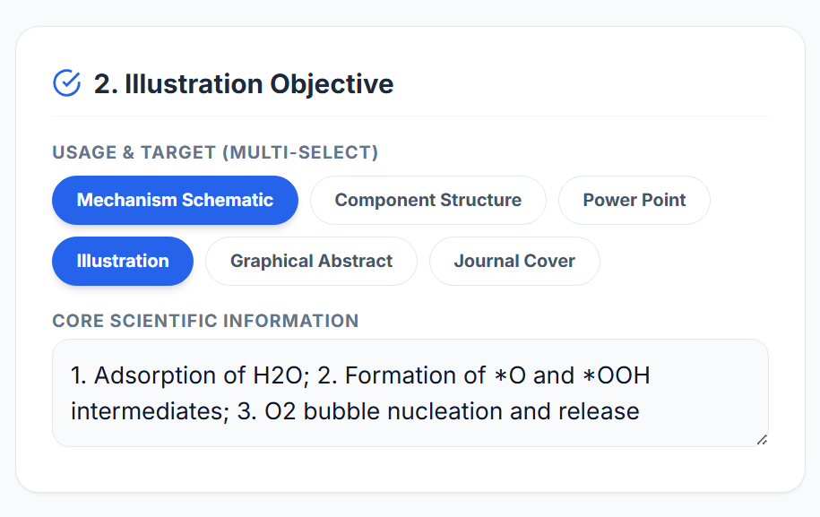
        

      

    </a>

    <a href="projects/ai-course" class="bento-card">
      

        Automation
        <h3 class="bento-title">n8n Concepts Workflow</h3>
        
Build 24/7 non-stop enterprise automation hubs by orchestrating nodes and connecting applications.

        

          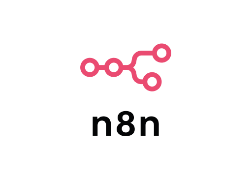
        

      

    </a>

    <a href="projects/vibe-coding" class="bento-card">
      

        Exploration
        <h3 class="bento-title">Vibe Coding</h3>
        
Interactive programming and exploring the limits of AI-assisted coding.

        

          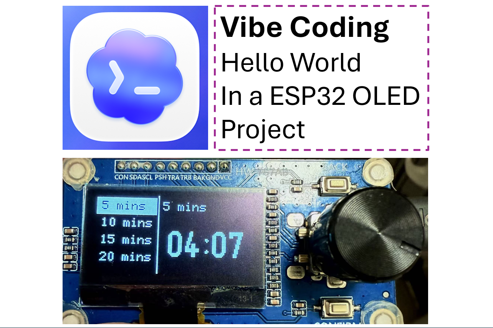
        

      

    </a>

    <a href="projects/raspberrypi-project/raspberrypi-page" class="bento-card">
      

        Hardware
        <h3 class="bento-title">Raspberry Pi Integration</h3>
        
Integrating hardware with AI and automation tools for physical-world interactions.

        

          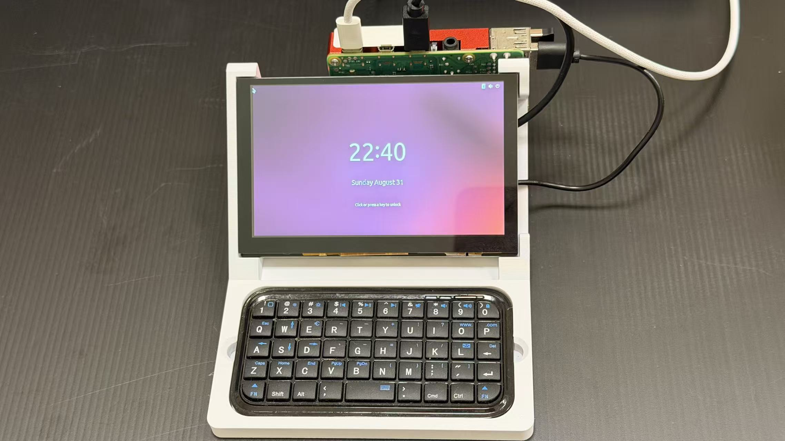
        

      

    </a>

    <a href="tvm-calculator" class="bento-card">
      

        Finance
        <h3 class="bento-title">Time Value of Money</h3>
        
Interactive TVM calculator for present value, future value, annuities, and amortization schedules.

        

          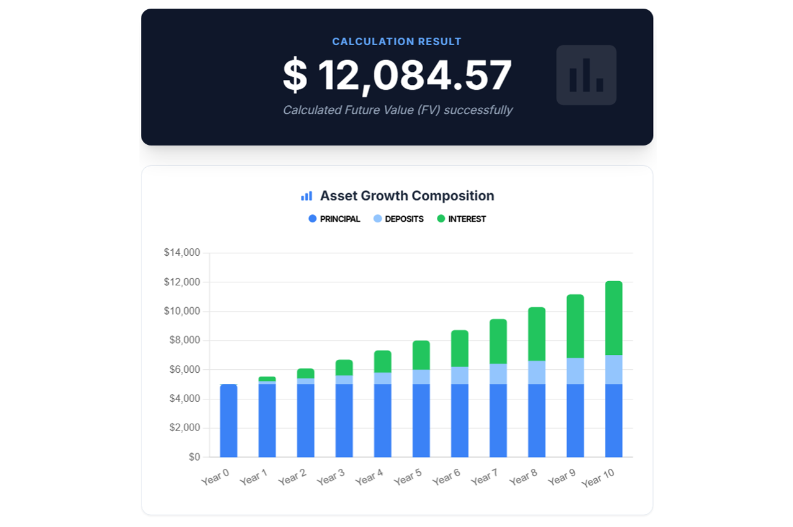
        

      

    </a>

    <a href="unit-converter" class="bento-card">
      

        Utility
        <h3 class="bento-title">Unit Converter</h3>
        
Fast unit conversion across length, weight, energy, area, pressure, and temperature.

        

          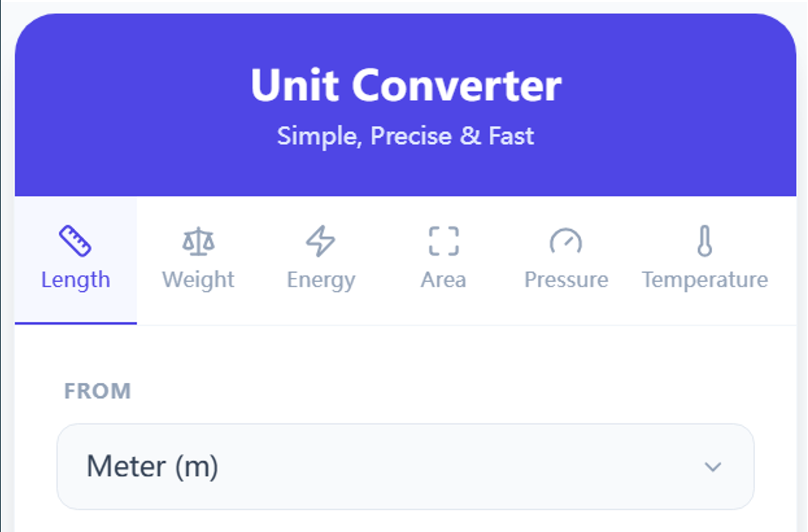
        

      

    </a>
    <a href="projects/screen-project/timer" class="bento-card">
      

        UI/UX
        <h3 class="bento-title">Screen Project</h3>
        
Custom screen menu systems and interfaces for embedded projects.

        

          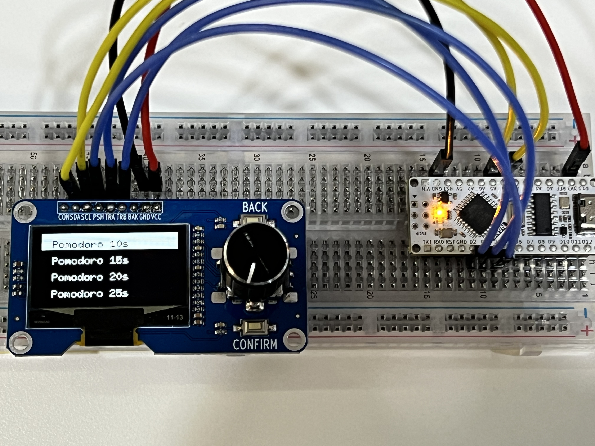
        

      

    </a>

    <a href="projects/screen-project/pomodo_timer_V4" class="bento-card">
      

        Embedded
        <h3 class="bento-title">Pomodo with case</h3>
        
Pomodoro timer built with ESP32, knob, and 1.3 OLED screen.

        

          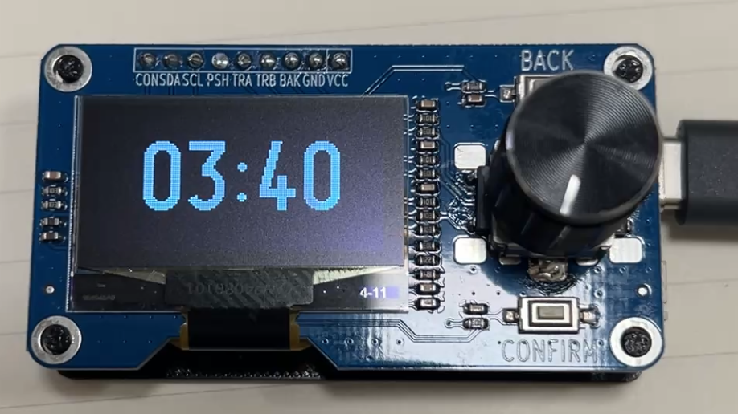
        

      

    </a>

    <a href="projects/screen-project/timer_091OLED_V3" class="bento-card">
      

        Embedded
        <h3 class="bento-title">Pomodo</h3>
        
Another variant of the Pomodoro timer project focusing on different OLED displays.

        

          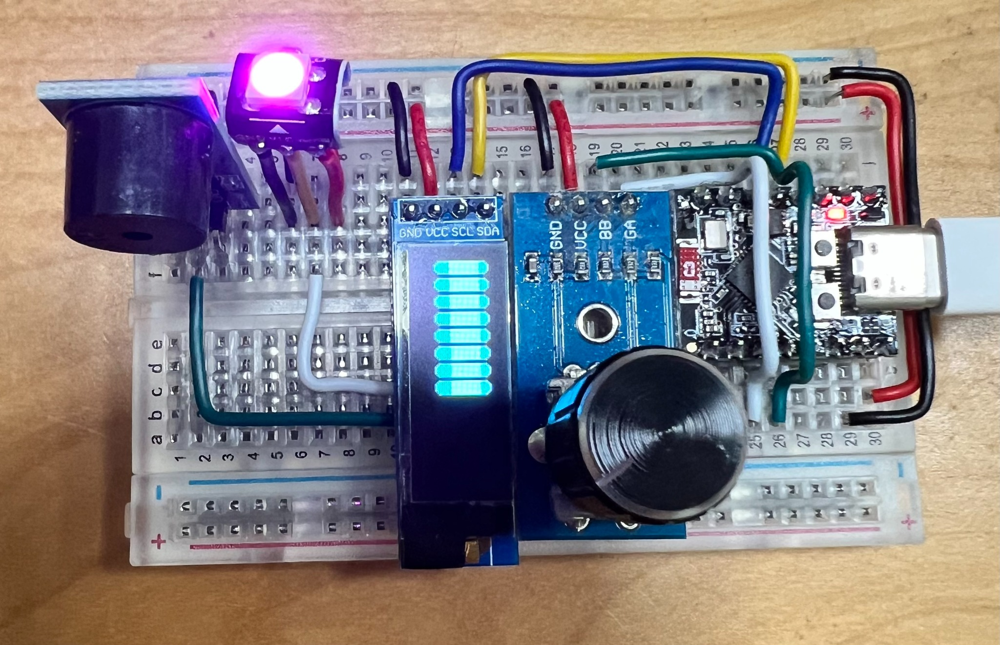
        

      

    </a>

    <a href="projects/screen-project/timer_091OLED" class="bento-card">
      

        Embedded
        <h3 class="bento-title">Pomodoro 0.91 OLED</h3>
        
Compact Pomodoro timer utilizing a 0.91 inch OLED screen.

        

          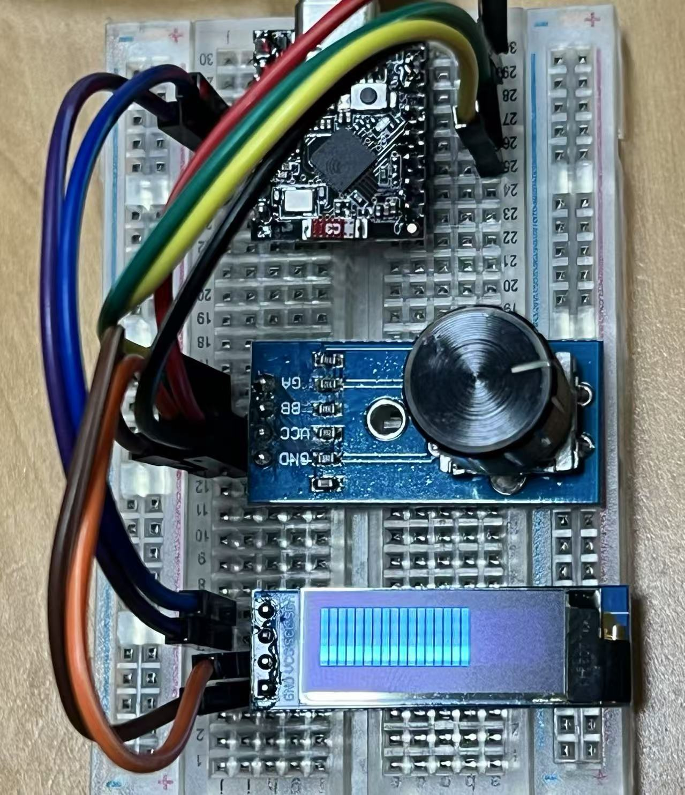
        

      

    </a>

    <a href="projects/lerobot" class="bento-card">
      

        Robotics
        <h3 class="bento-title">LeRobot</h3>
        
Exploring robotics and AI control with the LeRobot arm project.

        

          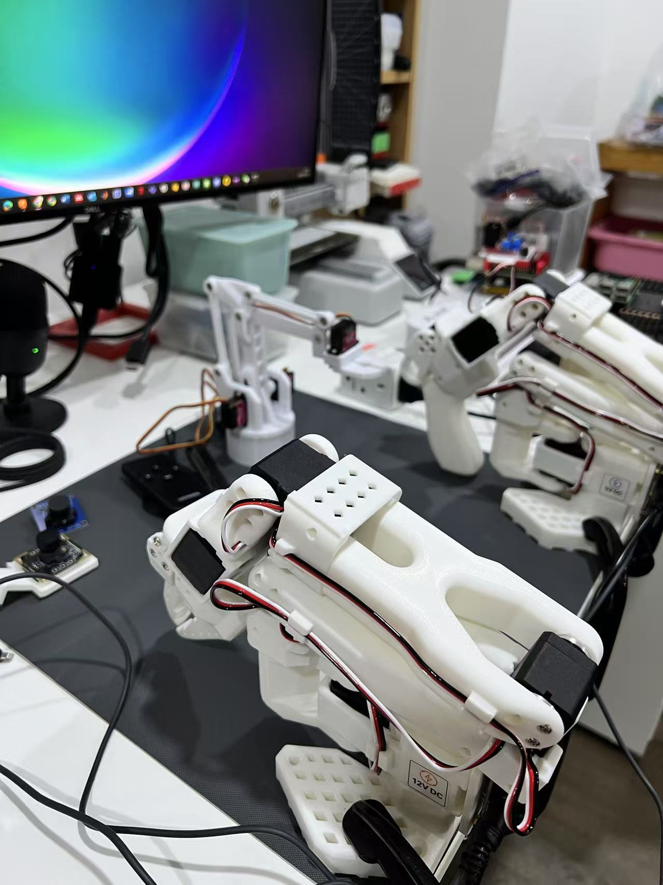
        

      

    </a>

    <a href="projects/quadruped" class="bento-card">
      

        Robotics
        <h3 class="bento-title">Quadruped</h3>
        
Building and programming a four-legged walking robot.

        

          
        

      

    </a>
  

