---
hide:
  - navigation
  - toc
---

  <!-- Existing project photography anchors a quiet, editorial laboratory identity. -->
  <section class="lab-hero" aria-labelledby="hero-title">
    

      
 AIone Lab / Ideas into practice

      <h1 id="hero-title">Small experiments. <em>Real possibilities.</em></h1>
      
A hands-on lab exploring AI, automation, and the physical world. Practical tools. Working prototypes. Everything learned along the way.

      

        <a class="lab-button" href="#projects">Explore the projects ↗</a>
        <a class="text-link" href="about/">Meet the maker →</a>
      

      
AI &amp; agentsWorkflow automationRobotics &amp; hardware

    

    <a class="hero-feature" href="projects/reachy-mini-hermes-agent/">
      
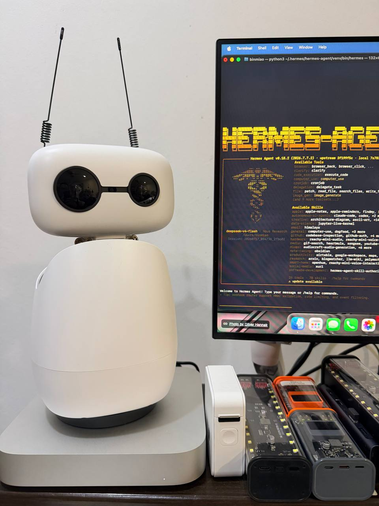From the workbench

      

Embodied AI / Featured project<h2>Meet your next AI companion.</h2>
↗

    </a>
  </section>

  <section class="lab-highlights" aria-label="Explore lab specialties">
    <a href="projects/local-rag/">01 / KNOWLEDGE<h2>Keep your AI close.</h2>
Private documents. Local intelligence.
Explore Local RAG ↗</a>
    <a href="projects/hermes-agent-raspberry-pi-4b-voice-setup/">02 / VOICE<h2>Give ideas a voice.</h2>
Real-time conversations on Raspberry Pi.
Build a voice agent ↗</a>
    <a href="projects/raspberry-pi-5-tank-stack-chan/">03 / ROBOTICS<h2>Bring code to life.</h2>
Small robots with a little personality.
Meet Stack Chan ↗</a>
    <a href="projects/ai-agent-terminal/">04 / HARDWARE<h2>A terminal of your own.</h2>
A physical home for your AI assistant.
See the AI terminal ↗</a>
  </section>

  <section class="project-section" id="projects" aria-labelledby="projects-title">
    

The project notebook
<h2 id="projects-title">Built. Tested. Documented.</h2>

Follow an idea from first experiment to something you can use.

    

      

        <button type="button" data-filter="all" aria-pressed="true">All projects</button>
        <button type="button" data-filter="ai" aria-pressed="false">AI &amp; knowledge</button>
        <button type="button" data-filter="automation" aria-pressed="false">Automation &amp; tools</button>
        <button type="button" data-filter="hardware" aria-pressed="false">Robotics &amp; hardware</button>
      

      
    

  

    <a href="projects/local-rag/" class="bento-card">
      

        Knowledge AI
        <h3 class="bento-title">Private Local RAG</h3>
        
Secure document querying and retrieval workflows for internal knowledge systems.

        

      

    </a>
    <a href="projects/hermes-agent-raspberry-pi-4b-voice-setup/" class="bento-card">
      

        Voice AI
        <h3 class="bento-title">Hermes Voice Agent</h3>
        
Real-time speech workflows with STT, LLM orchestration, and TTS on low-cost hardware.

        
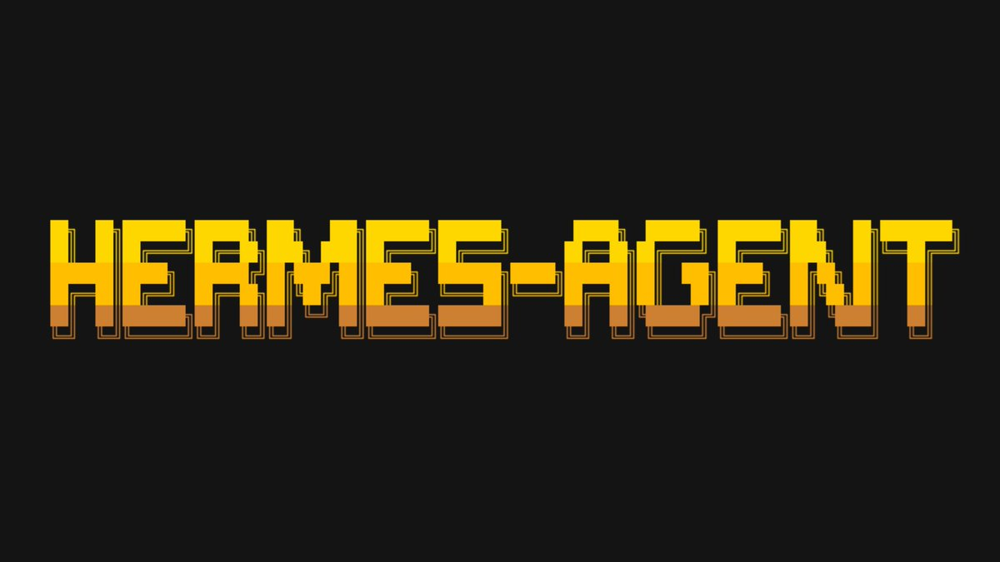

      

    </a>
    <a href="projects/raspberry-pi-5-tank-stack-chan/" class="bento-card">
      

        Companion AI
        <h3 class="bento-title">M5Stack Chan Robot</h3>
        
A mobile LLM companion with expressions, voice interaction, memory, and private AI expansion.

        
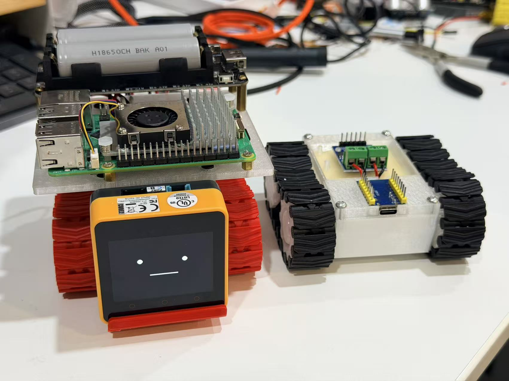

      

    </a>
    <a href="projects/ai-agent-terminal/" class="bento-card">
      

        AI Terminal
        <h3 class="bento-title">AI Agent Terminal</h3>
        
An all-in-one voice AI terminal connected to cloud or local models for coding and logs.

        
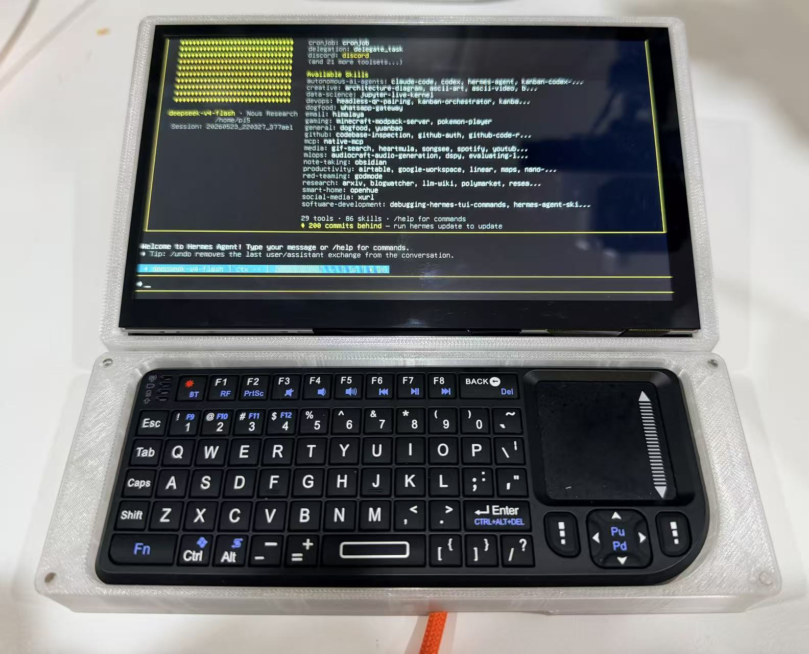

      

    </a>

    <a href="projects/local-ai-business-documents/" class="bento-card">
      

        Business Automation
        <h3 class="bento-title">Local AI Documents</h3>
        
Custom local-first AI systems for quotations, delivery orders, receipts, tax summaries, and daily business spreadsheets.

        

          
        

      

    </a>

    <a href="projects/reachy-mini-hermes-agent/" class="bento-card">
      

        Embodied AI
        <h3 class="bento-title">Reachy Mini x Hermes</h3>
        
Build a physical AI companion with Reachy Mini, Hermes Agent voice interaction, Obsidian memory, and future RAG workflows.

        

          
        

      

    </a>

    <a href="projects/personal-knowledge-base/" class="bento-card">
      

        Knowledge AI
        <h3 class="bento-title">Personal Knowledge Base</h3>
        
A living knowledge system managed by local or remote AI Agents for classification, semantic search, and connected documents.

        

          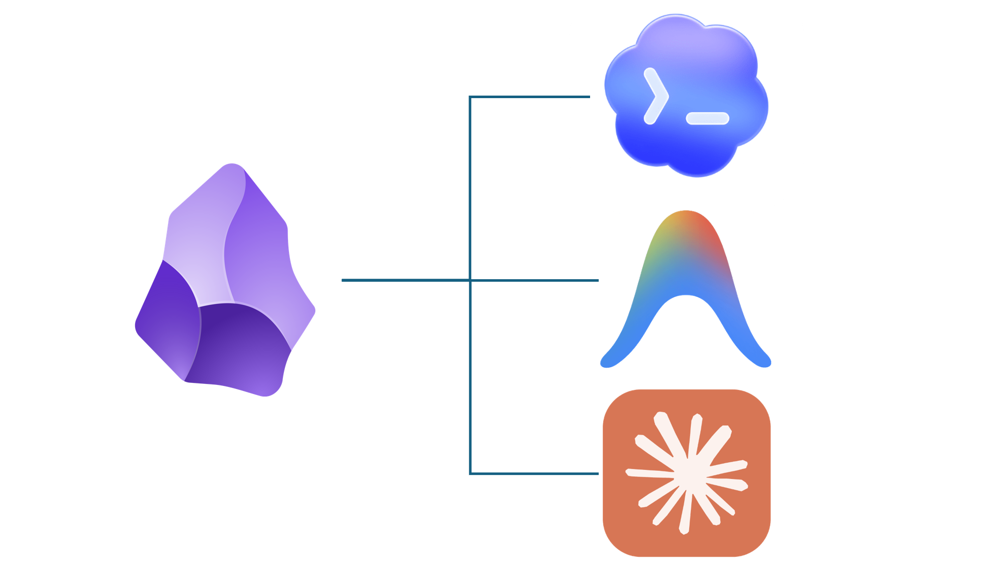
        

      

    </a>

    <a href="projects/cloudflare-worker-backend/" class="bento-card">
      

        Automation
        <h3 class="bento-title">Cloudflare Backend</h3>
        
Serverless foundations for API routing, protected keys, and deployable AI app backends.

        

          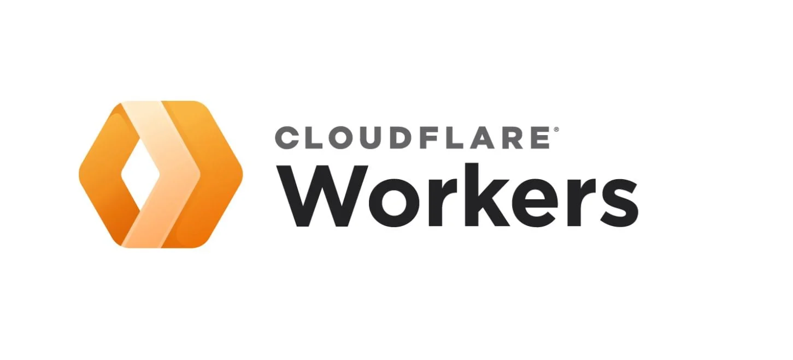
        

      

    </a>

    <a href="projects/hermes-agent-voice-mode/" class="bento-card">
      

        Voice AI
        <h3 class="bento-title">Hermes Agent Voice Mode</h3>
        
Step-by-step macOS setup to add real-time STT and TTS voice interaction to Hermes Agent.

        

          
        

      

    </a>

    <a href="projects/github-pages-mkdocs/" class="bento-card">
      

        Tutorial
        <h3 class="bento-title">Github Pages</h3>
        
Deploy a MkDocs static site on GitHub Pages and let an AI Agent manage the content autonomously.

        

          
        

      

    </a>

    <a href="projects/ai-knowledge-wiki/" class="bento-card">
      

        Knowledge
        <h3 class="bento-title">AI Knowledge Wiki</h3>
        
Let an AI Agent manage your personal Obsidian knowledge base — ingest, query, and maintain your second brain automatically.

        

          
        

      

    </a>

    <a href="aigc-prompt/" class="bento-card">
      

        AIGC
        <h3 class="bento-title">AIGC Prompt Gallery</h3>
        
Curated collection of AI-generated content prompts with full images and copyable prompts.

        

          
        

      

    </a>

    <a href="projects/tank-motor-assembly/" class="bento-card">
      

        Robotics
        <h3 class="bento-title">Mini Tank</h3>
        
Assemble a compact ESP32-C3 tracked tank and upload starter firmware for web control and obstacle avoidance.

        

          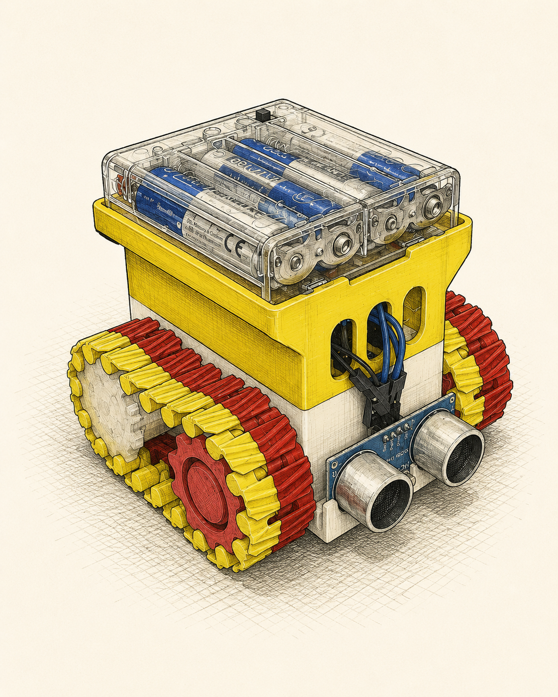
        

      

    </a>

    <a href="projects/notebooklm-tutorial/" class="bento-card">
      

        Tutorial
        <h3 class="bento-title">NotebookLM Guide</h3>
        
Learn how to use Google's AI note-taking tool to build your personal knowledge base.

        

          
        

      

    </a>

    <a href="prompt-generator/" class="bento-card">
      

        AI Tools
        <h3 class="bento-title">Prompt Generator</h3>
        
Instantly generate high-quality, customized AI prompts tailored to your specific needs.

        

          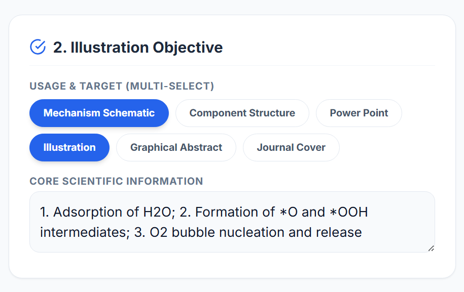
        

      

    </a>

    <a href="projects/ai-course/" class="bento-card">
      

        Automation
        <h3 class="bento-title">n8n Concepts Workflow</h3>
        
Build 24/7 non-stop enterprise automation hubs by orchestrating nodes and connecting applications.

        

          
        

      

    </a>

    <a href="projects/vibe-coding/" class="bento-card">
      

        Exploration
        <h3 class="bento-title">Vibe Coding</h3>
        
Interactive programming and exploring the limits of AI-assisted coding.

        

          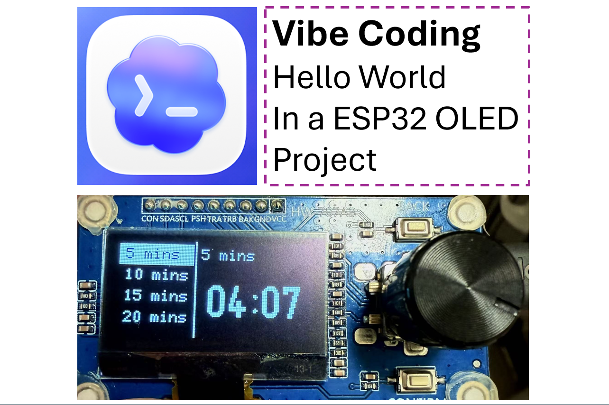
        

      

    </a>

    <a href="projects/raspberrypi-project/raspberrypi-page/" class="bento-card">
      

        Hardware
        <h3 class="bento-title">Raspberry Pi Integration</h3>
        
Integrating hardware with AI and automation tools for physical-world interactions.

        

          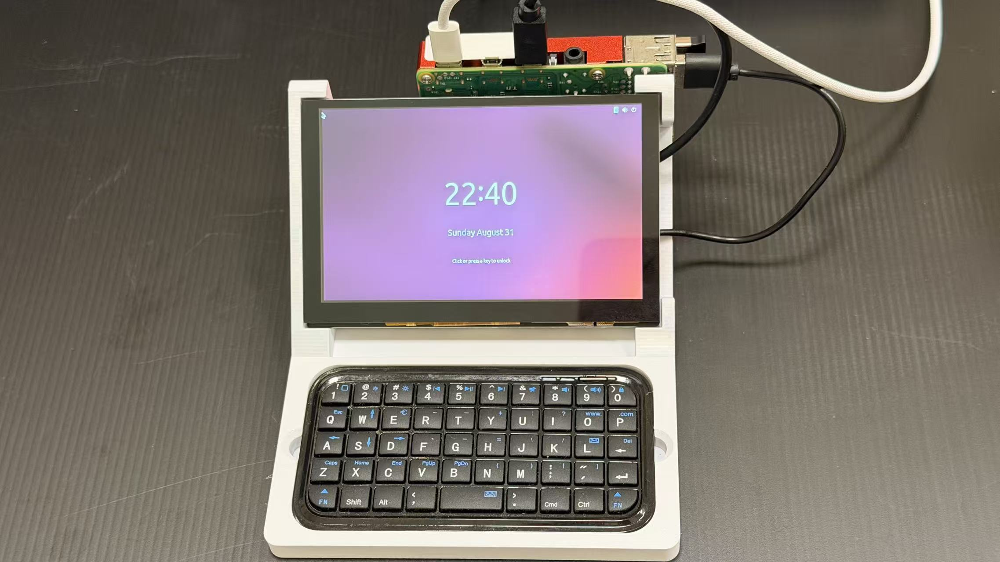
        

      

    </a>

    <a href="tvm-calculator/" class="bento-card">
      

        Finance
        <h3 class="bento-title">Time Value of Money</h3>
        
Interactive TVM calculator for present value, future value, annuities, and amortization schedules.

        

          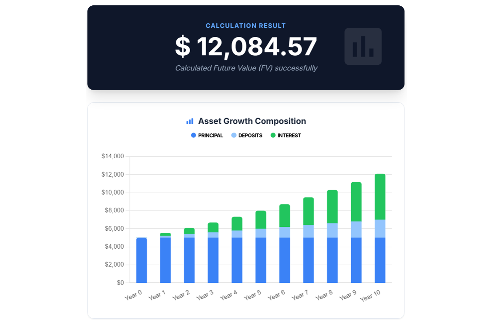
        

      

    </a>

    <a href="unit-converter/" class="bento-card">
      

        Utility
        <h3 class="bento-title">Unit Converter</h3>
        
Fast unit conversion across length, weight, energy, area, pressure, and temperature.

        

          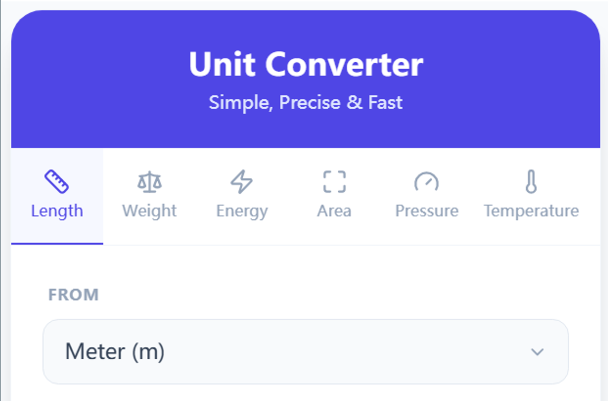
        

      

    </a>
    <a href="projects/screen-project/timer/" class="bento-card">
      

        UI/UX
        <h3 class="bento-title">Screen Project</h3>
        
Custom screen menu systems and interfaces for embedded projects.

        

          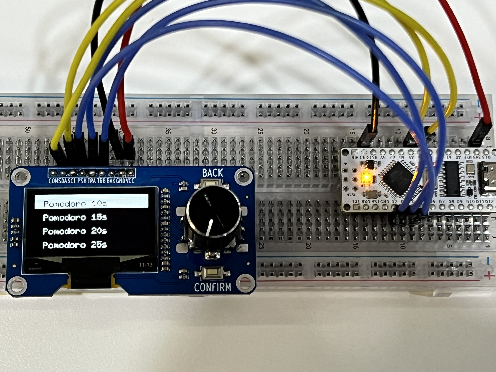
        

      

    </a>

    <a href="projects/screen-project/pomodo_timer_V4/" class="bento-card">
      

        Embedded
        <h3 class="bento-title">Pomodo with case</h3>
        
Pomodoro timer built with ESP32, knob, and 1.3 OLED screen.

        

          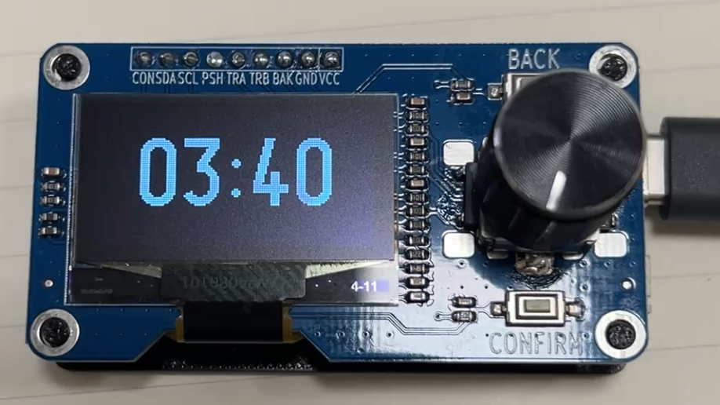
        

      

    </a>

    <a href="projects/screen-project/timer_091OLED_V3/" class="bento-card">
      

        Embedded
        <h3 class="bento-title">Pomodo</h3>
        
Another variant of the Pomodoro timer project focusing on different OLED displays.

        

          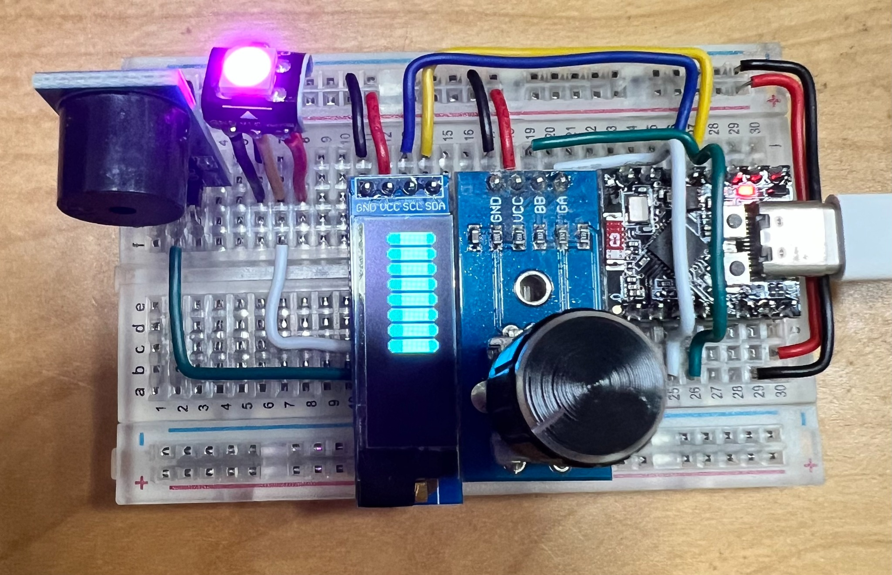
        

      

    </a>

    <a href="projects/screen-project/timer_091OLED/" class="bento-card">
      

        Embedded
        <h3 class="bento-title">Pomodoro 0.91 OLED</h3>
        
Compact Pomodoro timer utilizing a 0.91 inch OLED screen.

        

          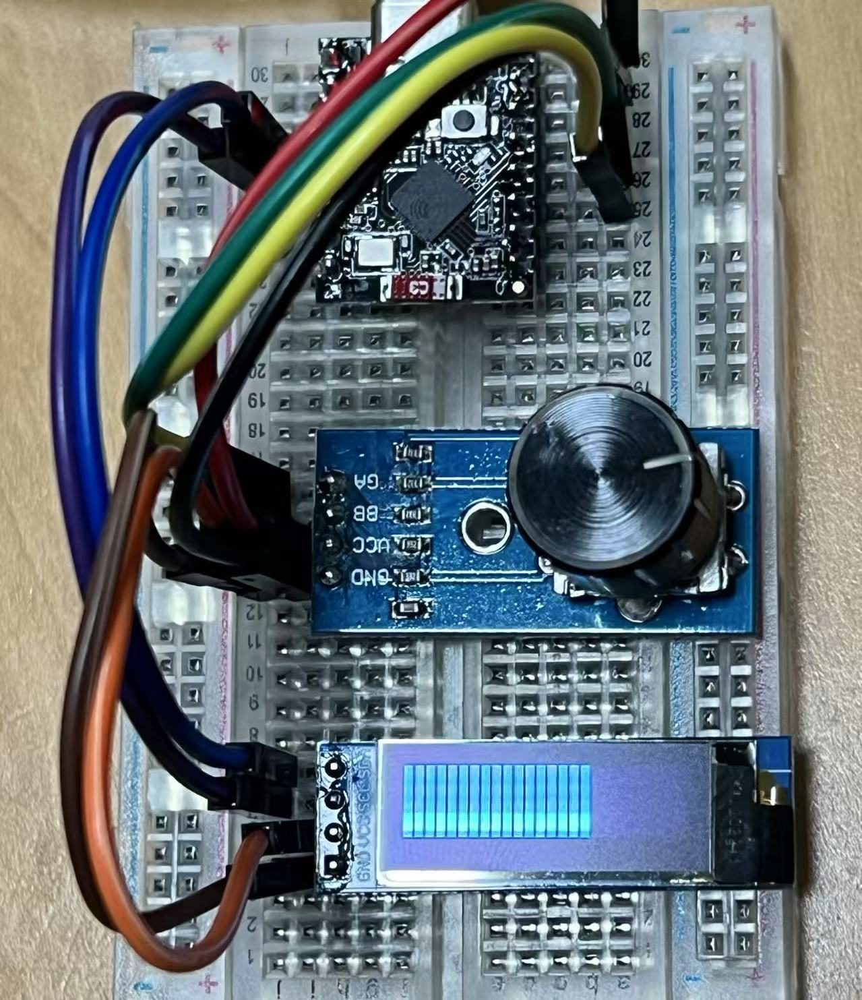
        

      

    </a>

    <a href="projects/lerobot/" class="bento-card">
      

        Robotics
        <h3 class="bento-title">LeRobot</h3>
        
Exploring robotics and AI control with the LeRobot arm project.

        

          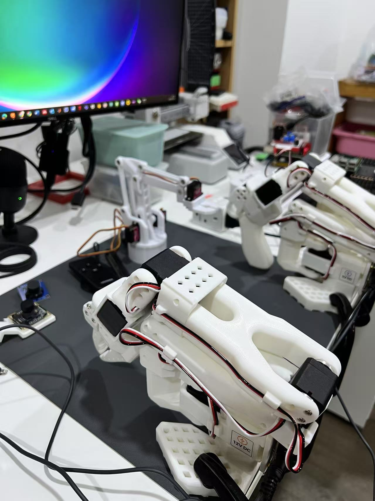
        

      

    </a>

    <a href="projects/quadruped/" class="bento-card">
      

        Robotics
        <h3 class="bento-title">Quadruped</h3>
        
Building and programming a four-legged walking robot.

        

          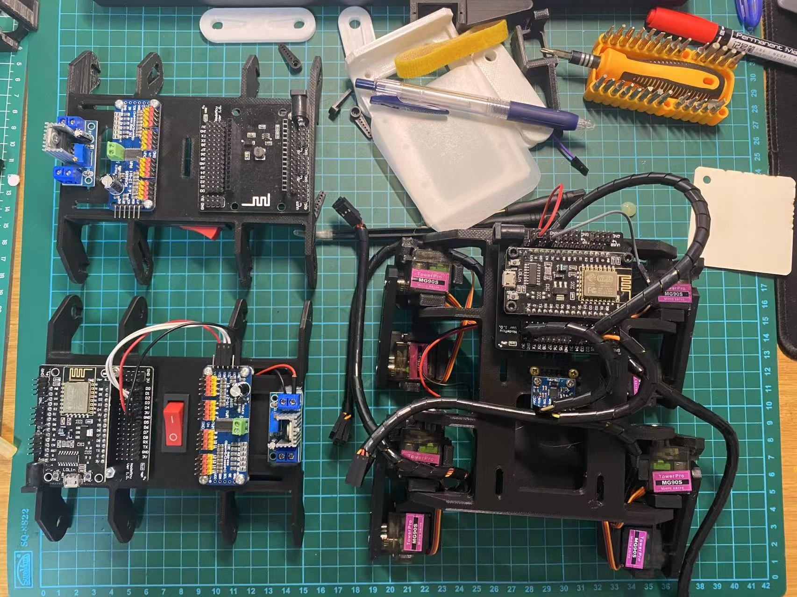
        

      

    </a>
  

  </section>
  <section class="lab-outro">

Always a work in progress
<h2>Good ideas start with a conversation.</h2>
<a class="lab-button" href="contact/">Let's connect ↗</a></section>

