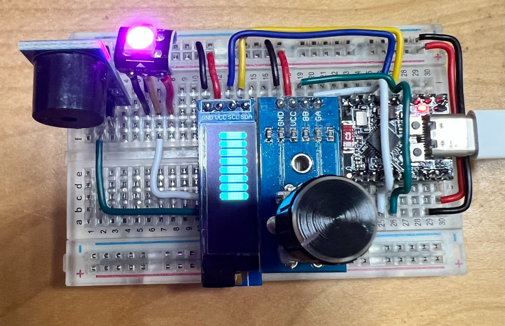

# Welcome to AIplay

Explore some of my projects:

  

    <a href="projects/screen-project/timer/">
      
      <strong>Screen Project</strong>
    </a>
  

  

    <a href="projects/lerobot">
       
      
<strong>LeRobot</strong>

    </a>
  

  

    <a href="projects/quadruped">
      
      <strong>Quadruped</strong>
    </a>
  

  

    <a href="projects/screen-project/timer_091OLED_V3">
      
      <strong>Pomodo</strong>
    </a>
  

  

    <a href="projects/screen-project/pomodo_timer_V4">
      
      <strong>Pomodo with case</strong>
    </a>
  

