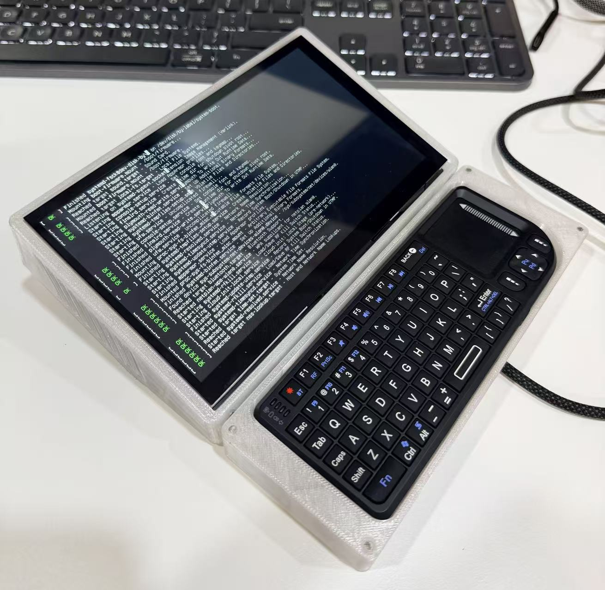
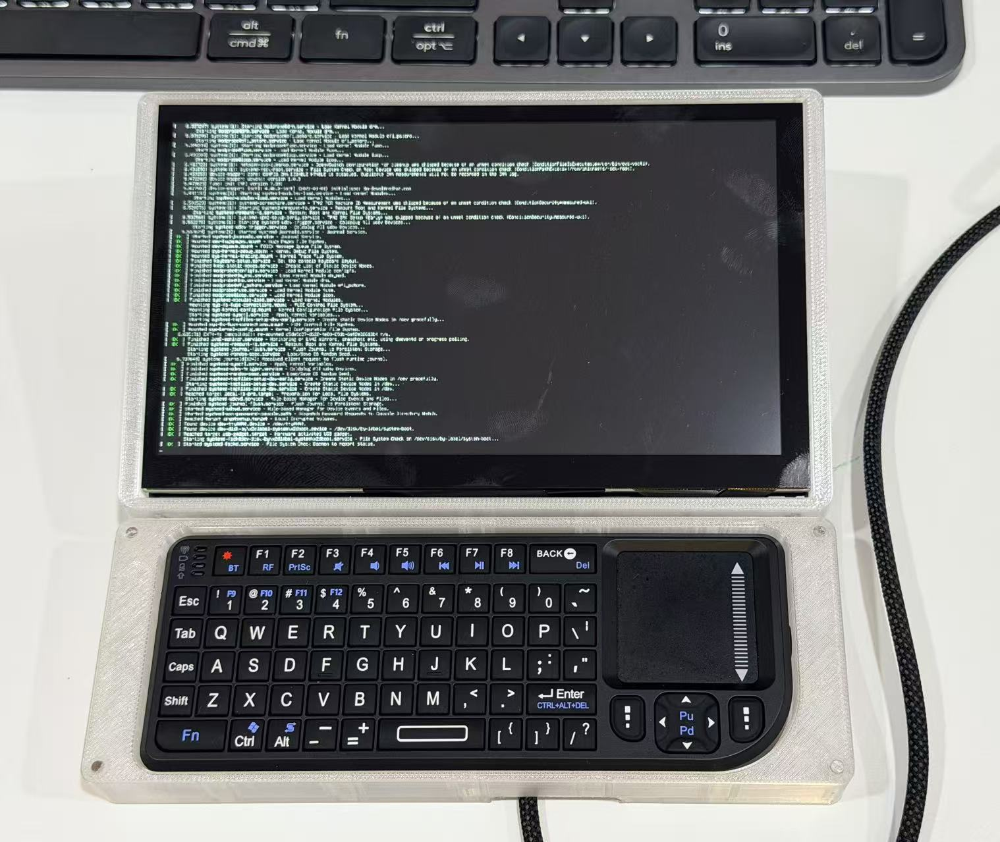

# AI Agent Terminal

**An all-in-one AI intelligent terminal for running a voice-enabled AI Agent connected to cloud or private large language models.**

This project explores a dedicated physical terminal for AI agents. Instead of keeping the agent inside a browser tab or chat app, the terminal becomes a focused workspace where the AI can listen, speak, code, organize logs, and work together with the user.

The terminal can connect to cloud-based large models through APIs, or to a locally deployed model running on another workstation, desktop, or high-performance computing machine. This makes it flexible enough for quick cloud prototyping and private local AI workflows.

## Project Idea

The core idea is to build a small, always-ready AI workstation. It is not just a screen attached to a computer. It is a dedicated interface for interacting with an AI Agent through natural speech and task-oriented workflows.

The user can talk to the terminal, ask it to reason through a coding task, summarize a development log, organize notes, or help maintain a running project journal. The terminal then becomes a bridge between human intention and long-running AI work.

## What It Can Do

| Capability | Description |
| --- | --- |
| **Voice interaction** | Speak with the AI Agent using microphone input and voice output instead of typing every command |
| **Cloud LLM connection** | Use API-based models for fast reasoning, coding help, planning, and general assistant tasks |
| **Local model connection** | Connect to a local model hosted on a desktop, workstation, or compute server for private workflows |
| **Coding assistance** | Help write code, inspect files, explain errors, plan changes, and support iterative development |
| **Log organization** | Convert messy work notes, terminal records, voice memos, and project updates into structured logs |
| **Knowledge work** | Summarize documents, maintain project memory, and support personal or team knowledge management |

## Architecture

| Layer | Role |
| --- | --- |
| **Terminal Interface** | A dedicated screen and input/output environment for the AI Agent |
| **Voice Module** | Speech input and text-to-speech output for hands-free interaction |
| **Agent Runtime** | Coordinates prompts, tools, memory, files, and task execution |
| **Model Backend** | Uses either cloud LLM APIs or a local model served from another machine |
| **Storage Layer** | Keeps coding notes, logs, transcripts, summaries, and project records |

This architecture keeps the terminal lightweight while allowing the model backend to scale. For daily use, it can call a cloud model. For private or heavier workloads, it can connect to a local model hosted on a more powerful machine.

## Use Cases

### Coding Companion

The terminal can act as a voice-controlled coding partner. You can ask it to explain a stack trace, draft a function, summarize a codebase, or keep track of what changed during a development session.

### Log and Journal Assistant

A major direction is automatic log organization. The AI Agent can turn short notes and voice updates into structured daily logs, project records, experiment notes, and searchable personal memory.

### Private Local AI Interface

When connected to a local large model, the terminal can become a private AI endpoint for a home lab or company office. Sensitive code, internal documents, and private logs can remain inside the local network instead of being uploaded to external services.

### Always-Ready AI Workbench

Because the terminal is a dedicated device, it reduces the friction of opening a laptop, switching apps, and setting context again. It can become a persistent AI workbench for focused tasks.

## Prototype Gallery

  
  
  

## Roadmap

- Improve voice input and output quality
- Add persistent conversation and task memory
- Build structured daily and project log templates
- Connect coding workflows to local repositories
- Add local LLM backend support through a desktop or compute server
- Create a private knowledge base for documents, notes, and project history

## Long-Term Vision

The long-term vision is an AI Agent terminal that feels like a small colleague on the desk: always available, voice-accessible, connected to powerful models, and able to help with both creative and operational work.

For personal use, it can become a coding companion and journal system. For a team or company, it can become a private AI terminal connected to internal knowledge, logs, and development workflows.

