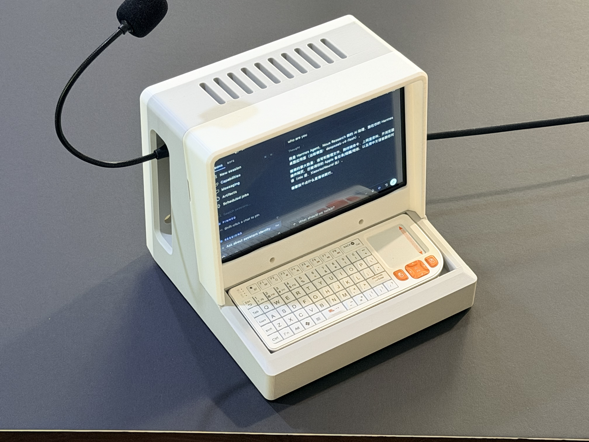
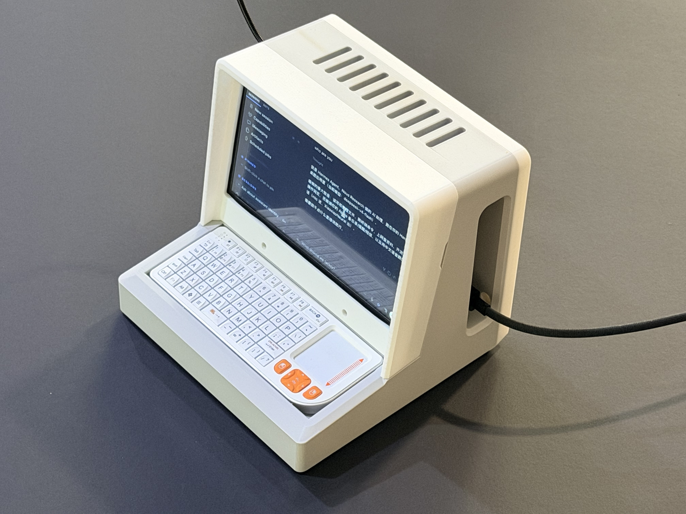
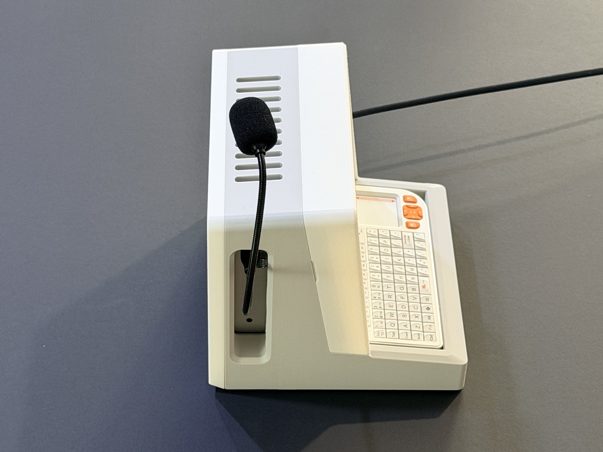
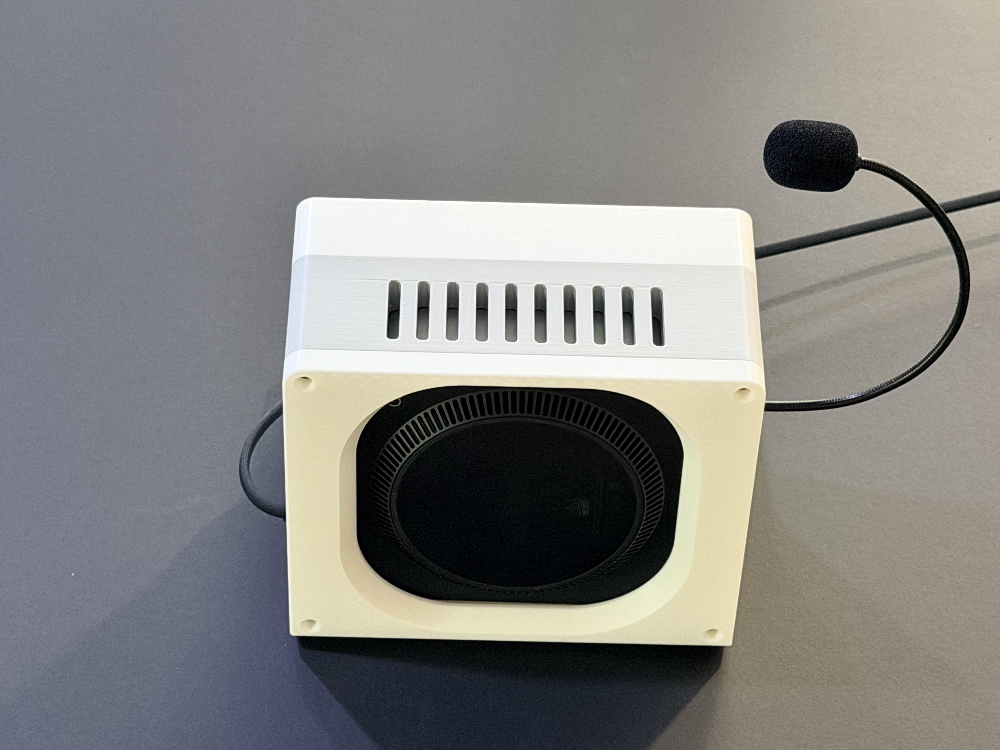
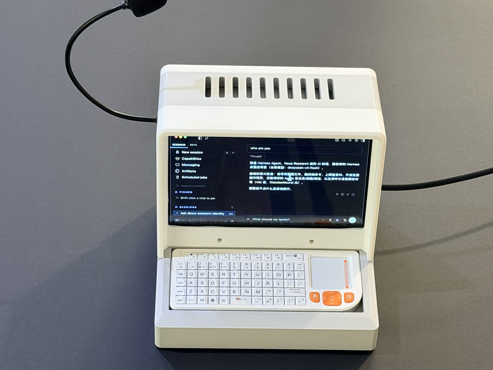

# AI Agent Terminal

**A private command center for Hermes Agent: voice, coding, notes, and everyday operations brought back onto your own network.**

This project explores a dedicated physical terminal for AI agents. Instead of keeping the agent inside a browser tab or chat app, the terminal becomes a focused workspace where the AI can listen, speak, code, organize logs, and work together with the user.

The terminal can connect to cloud-based large models through APIs, or to a locally deployed model running on another workstation, desktop, or high-performance computing machine. The headline idea is simple: deploy Hermes locally, then turn the same machine into a calm, always-ready front door for work that normally gets scattered across chat apps, browser tabs, terminal windows, and note systems.

## The Local Hermes Thesis

The core idea is to build a small, always-ready AI workstation. It is not just a screen attached to a computer. It is a dedicated interface for interacting with an AI Agent through natural speech and task-oriented workflows.

The terminal is designed around a local Hermes deployment rather than a disposable web chat. Hermes can sit beside the files, logs, prompts, and services it is meant to operate. That proximity changes the experience: context can stay close to the work, conversations can become durable records, and the agent can be shaped around the routines of one person, one lab, or one small team.

The user can speak to the terminal, ask it to reason through a coding task, summarize a development log, organize notes, or maintain a running project journal. The physical screen makes the agent feel less like another tab and more like a persistent instrument on the desk.

## Localize the Workday

The most compelling feature is not a single model benchmark. It is the ability to localize the small, repeated workflows that consume attention every day:

- **Capture:** turn a voice memo, terminal output, or rough thought into a timestamped work note.
- **Understand:** summarize a document, explain an error, extract action items, or compare two design decisions.
- **Act:** prepare a command, update a project log, draft a checklist, or route a task to the right local tool.
- **Remember:** save the result into a searchable project memory instead of letting it disappear in chat history.

With the right permissions and tool adapters, this becomes a local operations layer: a personal interface over files, scripts, repositories, home-lab services, and knowledge bases. The cloud can remain an optional accelerator; the workflow itself stays inspectable and close at hand.

## What It Can Do

| Capability | Description |
| --- | --- |
| **Voice interaction** | Speak with the AI Agent using microphone input and voice output instead of typing every command |
| **Cloud LLM connection** | Use API-based models for fast reasoning, coding help, planning, and general assistant tasks |
| **Local model connection** | Connect to a local model hosted on a desktop, workstation, or compute server for private workflows |
| **Coding assistance** | Help write code, inspect files, explain errors, plan changes, and support iterative development |
| **Log organization** | Convert messy work notes, terminal records, voice memos, and project updates into structured logs |
| **Knowledge work** | Summarize documents, maintain project memory, and support personal or team knowledge management |

## Architecture

| Layer | Role |
| --- | --- |
| **Terminal Interface** | A dedicated screen and input/output environment for the AI Agent |
| **Voice Module** | Speech input and text-to-speech output for hands-free interaction |
| **Agent Runtime** | Coordinates prompts, tools, memory, files, and task execution |
| **Model Backend** | Uses either cloud LLM APIs or a local model served from another machine |
| **Storage Layer** | Keeps coding notes, logs, transcripts, summaries, and project records |

This architecture keeps the terminal lightweight while allowing the model backend to scale. For daily use, it can call a cloud model. For private or heavier workloads, it can connect to a local model hosted on a more powerful machine. The important boundary is yours: you decide which data leaves the network, which tools Hermes can call, and how long the resulting memory is kept.

## Use Cases

### Coding Companion

The terminal can act as a voice-controlled coding partner. You can ask it to explain a stack trace, draft a function, summarize a codebase, or keep track of what changed during a development session.

### Log and Journal Assistant

A major direction is automatic log organization. The AI Agent can turn short notes and voice updates into structured daily logs, project records, experiment notes, and searchable personal memory.

### Private Local AI Interface

When connected to a local large model, the terminal can become a private AI endpoint for a home lab or company office. Sensitive code, internal documents, and private logs can remain inside the local network instead of being uploaded to external services.

### Always-Ready AI Workbench

Because the terminal is a dedicated device, it reduces the friction of opening a laptop, switching apps, and setting context again. It can become a persistent AI workbench for focused tasks.

## A Desk-Sized Interface for Long-Running Work

The physical form factor is deliberately practical. It gives voice interaction a visible home, keeps a task or status screen in view, and makes long-running work feel present without demanding a laptop-sized dashboard. Imagine opening the day with a spoken brief, handing off a build log while you make coffee, then asking for the next action without reconstructing the context from scratch.

## Prototype Gallery

  
  
  
  
  

## Roadmap

- Improve voice input and output quality
- Add persistent conversation and task memory
- Build structured daily and project log templates
- Connect coding workflows to local repositories
- Add local LLM backend support through a desktop or compute server
- Create a private knowledge base for documents, notes, and project history

## Long-Term Vision

The long-term vision is an AI Agent terminal that feels like a small colleague on the desk: always available, voice-accessible, connected to powerful models, and able to help with both creative and operational work.

For personal use, it can become a coding companion and journal system. For a team or company, it can become a private AI terminal connected to internal knowledge, logs, and development workflows.

