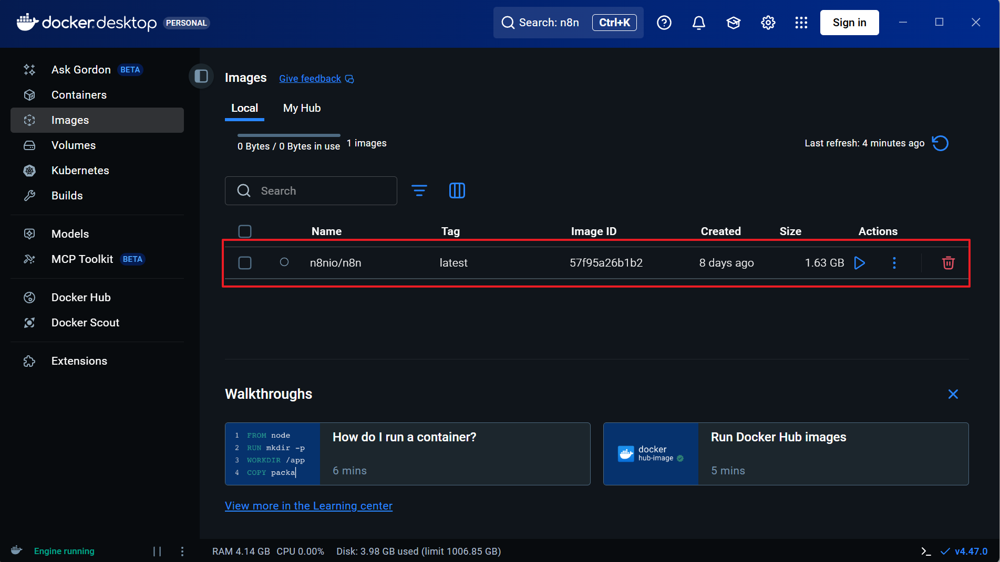
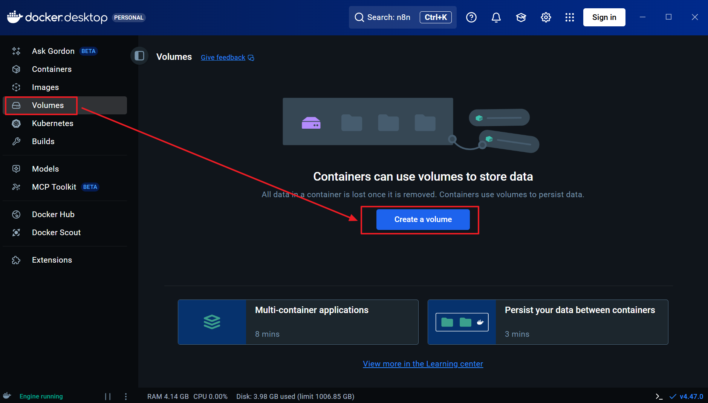
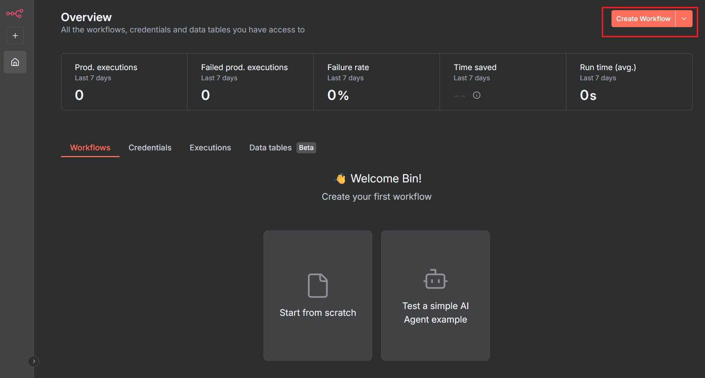

# n8n Workflow

This page collects notes about my **n8n** workflows and how I’m using them in small automation projects.

---

## 🚀 Quick Docker setup for n8n

Follow this graphical installation flow to set up n8n quickly using Docker:

**Step 1:** After Docker installation, go to "images" search for n8n, and pull the image.

**Step 2:** Check the pulled image.

**Step 3:** Go to "Volumes" and "Create a Volume".

**Step 4:** Check the created volume.

**Step 5:** Run the new container with the n8n loaded inside by clicking the "Run" button.

**Step 6:** Now you are inside n8n and click the "Create Workflow" to start.

**Step 7:** Here is a basic structure of n8n workflow. From here you can start your workflow creation.

After finishing these steps, open `http://localhost:5678` in your browser and complete the initial setup wizard to start building your workflows.

---

## 📸 Project 1 – AI Background Replacement and Selfie Booth

An AI selfie booth that takes photos of users and generates any background, or transforms the user into any famous character. The image shows a passerby taking a photo in front of an open-style selfie booth. The front screen (acting like a mirror) displays a real-time image of the passerby transformed into Captain America.

---

## 📝 Project 2 – Student Assignment Grading & Exercise Recommendation System

The second n8n project is a **student assignment grading system**:

**Goal**
- Students take photos of their assignments (paper homework, exercises) and upload them.
- The system automatically recognizes the questions and answers, and provides grading feedback.
- Based on the types of errors, it recommends a few **similar exercises** to help reinforce weak areas.

**n8n Workflow Idea**
- Trigger: Students upload homework photos via a form / Webhook.
- Processing pipeline:
  1. OCR / Vision model recognizes the questions and the student's answers.
  2. Call a large language model (e.g., GPT family) to grade and analyze against the standard answers.
  3. Based on the knowledge gaps, generate **3–5 similar exercises** from a question bank or the LLM.
  4. Combine the grading feedback + explanations + new exercises into a report, returning it via email or a frontend page.

**What kind of product should this be?**
- Standalone: A small tool for personal use by teachers (photo → grading → generate PDF of exercises).
- Web version: Students self-upload and get real-time "grading + exercises" feedback.
- Integrated with existing LMS / homework systems: Connect via n8n's HTTP / API nodes into existing systems.

---

I will continue to add specific n8n node configuration screenshots and exported JSON files here later, so you can easily import and reuse the workflows.*** End Patch***}...
