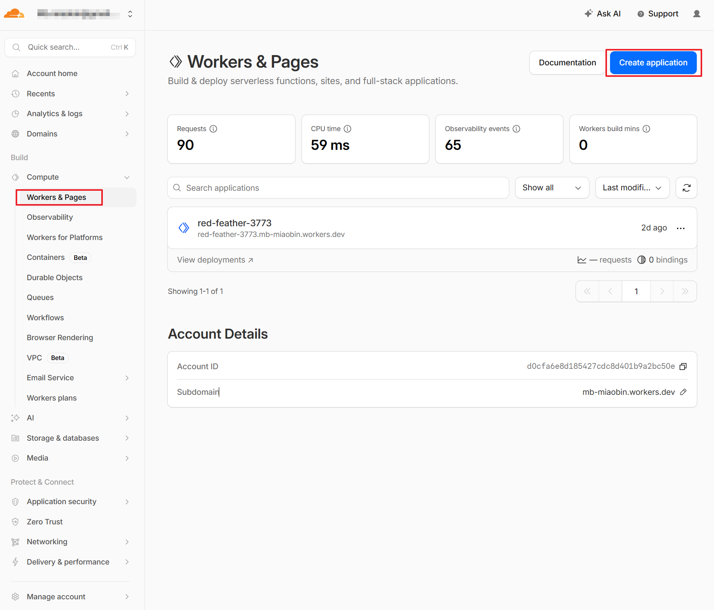
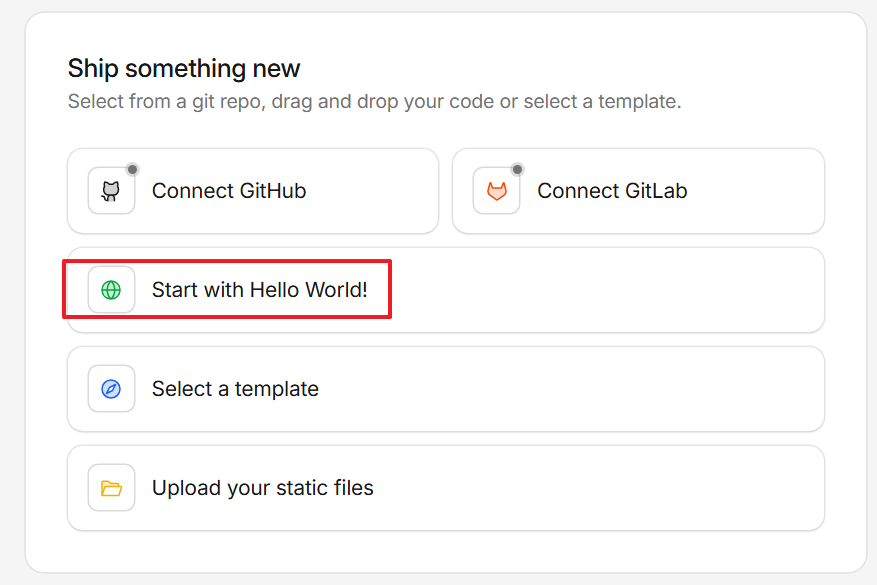
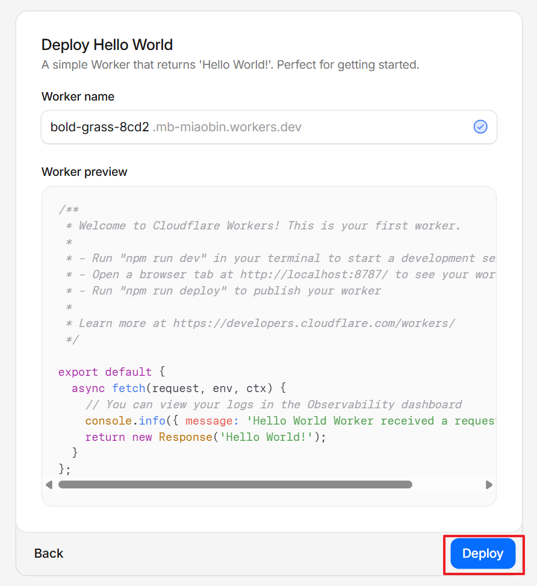
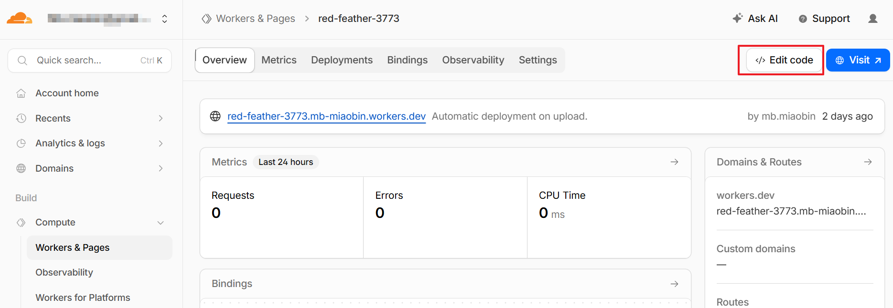
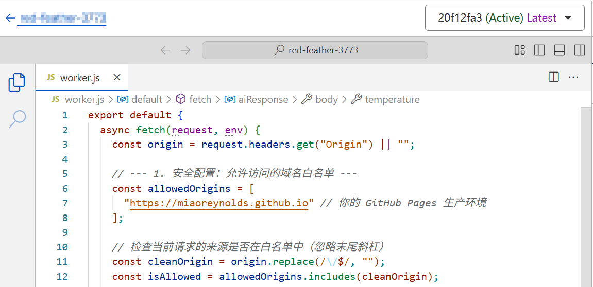
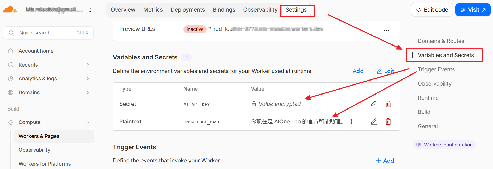

# Cloudflare Worker Backend Setup Guide

This page shows how to create a Cloudflare Worker from scratch and use it as the backend for your website.

## Step 1: Open Workers & Pages and create an application

In the Cloudflare dashboard, click `Workers & Pages` in the left sidebar, then click `Create application` in the top-right corner.

## Step 2: Start with the Hello World template

In the "Ship something new" screen, choose `Start with Hello World!` to initialize a Worker quickly.

## Step 3: Set Worker name and deploy

In the `Deploy Hello World` screen:

1. Enter or confirm your `Worker name`
2. Review the default code preview
3. Click `Deploy`

After deployment, Cloudflare gives you a public `*.workers.dev` URL.

## Step 4: Open the Worker and edit code

After deployment, go to the Worker overview page and click `Edit code` to open the online editor.

## Step 5: Implement backend logic in worker.js

Edit `worker.js` to implement your backend API logic, for example:

1. Read `Origin` from request headers
2. Configure a frontend allowlist for CORS
3. Process requests and return JSON responses

The example in the screenshot already includes allowlist checking, which is a good pattern for GitHub Pages frontend + Worker backend integration.

## Step 6: Configure Variables and Secrets in Settings

Go to `Settings`, open `Variables and Secrets`, then add runtime configuration:

1. `Secret`, for example `AI_API_KEY` (store API keys securely)
2. `Plaintext`, for example `KNOWLEDGE_BASE` (store non-sensitive config text)

Your Worker code can read these environment variables at runtime, so sensitive values are not hardcoded in source code.

## Step 7: Call the Worker URL from your frontend

In your frontend application, send requests to your Worker endpoint (the `*.workers.dev` URL, or your custom domain route). This is the final step that connects frontend and Cloudflare backend.

Once connected, the backend can handle and protect key server-side responsibilities, such as:

1. Storing API keys securely
2. Processing and storing user data
3. Managing system prompts and backend business logic

## Final checks

1. Click `Visit` to confirm the Worker is reachable
2. Test frontend-to-Worker requests and verify CORS behavior
3. Redeploy and run regression checks after each backend update
