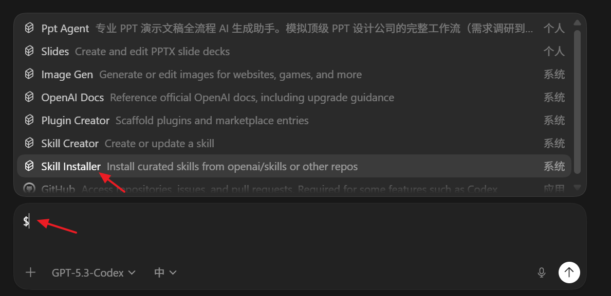
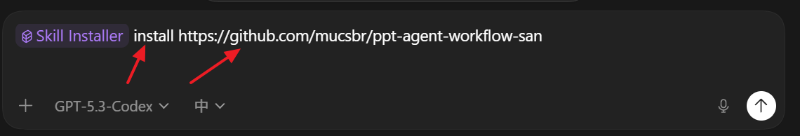

# Installing a Skill in OpenAI Codex


**OpenAI Codex** is an AI coding agent that works directly in your terminal. It can read files, write code, run commands, and iterate — all from a single CLI session. One of its most powerful features is **Skills**: reusable, markdown-based instruction sets that teach Codex how to handle specific workflows in your project.

---

## What Is a Skill?

A **Skill** is a `.md` file that lives in a special folder inside your repo (`.codex/skills/` or similar). When Codex detects a relevant skill, it reads the instructions automatically and applies them — no extra prompting needed.

Typical use cases:

- Project-specific build or deploy steps
- Coding conventions and style guides
- Repeated refactoring patterns
- Domain knowledge (e.g., how your API is structured)

---

## Step 1 — Create the Skills Folder & File

In your project root, create the directory and skill file:

```bash
mkdir -p .codex/skills
touch .codex/skills/my-skill.md
```

Open `my-skill.md` and write your instructions in plain markdown. For example:

```markdown
---
name: "Run Dev Server"
description: "How to start the local development server for this project."
---

Always use `npm run dev` to start the dev server.
The server runs on port 3000. Never use port 8080.
After starting, verify the server is healthy by checking http://localhost:3000/health.
```

The YAML frontmatter (`name`, `description`) helps Codex identify and surface the skill. The body is freeform markdown — write it as you would write a note for a teammate.

---

## Step 2 — Install & Verify in Codex



After creating the skill file, open a Codex session in your project:

```bash
codex
```

Codex will automatically scan `.codex/skills/` on startup. You can confirm a skill was loaded by asking:

> *"What skills do you have loaded?"*

Codex will list all detected skills and their descriptions from the frontmatter.

---

## Step 3 — Use the Skill in a Session



Once loaded, the skill is applied automatically whenever the context is relevant. You can also trigger it explicitly:

> *"Use the Run Dev Server skill to start the project."*

Codex will follow the instructions in the skill file step by step — running the right command, on the right port, with the health check.

---

## Tips

| Tip | Details |
|-----|---------|
| **Keep skills focused** | One skill = one workflow. Don't combine unrelated steps. |
| **Use concrete commands** | The more specific the instruction, the more reliably Codex follows it. |
| **Version control your skills** | Commit `.codex/skills/` to Git so the whole team benefits. |
| **Iterate** | If Codex doesn't follow a step correctly, rewrite that instruction more explicitly. |

---

## Quick Reference

```
your-project/
└── .codex/
    └── skills/
        ├── dev-server.md
        ├── run-tests.md
        └── deploy.md
```

Each file is an independent skill. Codex loads them all at the start of every session.
