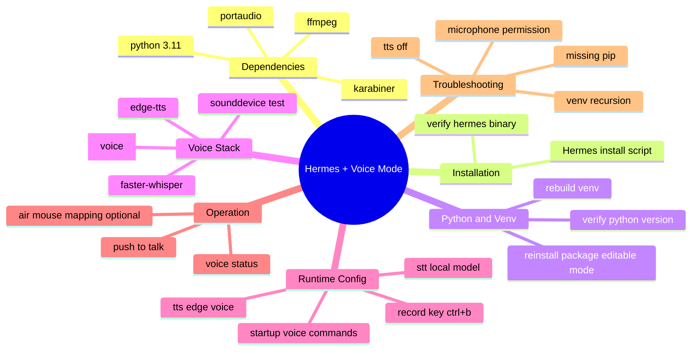

# Add Voice Module to Hermes Agent (macOS)

This guide is a complete, command-first setup for enabling **Voice Mode** in Hermes Agent on macOS.

---

## Architecture Snapshot


---

## 1. Install Homebrew Dependencies

```bash
brew install python@3.11
brew install portaudio ffmpeg
brew install --cask karabiner-elements
```

---

## 2. Install Hermes Agent

Official installer:

```bash
curl -fsSL https://hermes-agent.nousresearch.com/install.sh | sh
```

Check installation:

```bash
which hermes
hermes
```

---

## 3. Fix Python Version (Critical)

Hermes requires:

```text
Python >= 3.11
```

Check current Python:

```bash
python3 --version
```

If you still see macOS default, for example:

```text
Python 3.9.x
```

Use Homebrew Python:

```bash
/opt/homebrew/bin/python3.11 --version
```

---

## 4. Rebuild Hermes Virtual Environment (Important)

```bash
cd ~/.hermes/hermes-agent

rm -rf venv

/opt/homebrew/bin/python3.11 -m venv venv

source venv/bin/activate

python -m ensurepip --upgrade

python -m pip install -U pip setuptools wheel

python -m pip install -e .
```

---

## 5. Install Voice Mode Dependencies

Activate Hermes venv:

```bash
cd ~/.hermes/hermes-agent
source venv/bin/activate
```

Install voice extras:

```bash
pip install -U ".[voice]"
```

Install missing packages explicitly:

```bash
pip install -U \
sounddevice \
soundfile \
numpy \
faster-whisper \
edge-tts
```

---

## 6. Test PortAudio / Microphone

```bash
python - <<'PY'
import sounddevice as sd
print(sd.query_devices())
PY
```

Expected output includes devices like:

```text
MacBook Pro Microphone
MacBook Pro Speakers
```

---

## 7. Test Edge TTS

```bash
edge-tts \
--voice zh-CN-XiaoxiaoNeural \
--text "你好，我是 Hermes。" \
--write-media test.mp3

afplay test.mp3
```

---

## 8. Edit Hermes Configuration

Edit config:

```bash
nano ~/.hermes/config.yaml
```

Recommended config:

```yaml
stt:
  enabled: true
  provider: local
  local:
    model: base

tts:
  enabled: true
  provider: edge
  edge:
    voice: zh-CN-YunxiNeural

voice:
  record_key: ctrl+b
  max_recording_seconds: 120

startup_commands:
  - "/voice on"
  - "/voice tts"
```

Save in nano:

```text
Ctrl + O
Enter
Ctrl + X
```

---

## 9. Start Hermes

```bash
killall hermes 2>/dev/null
hermes
```

---

## 10. Check Voice Status

Inside Hermes:

```text
/voice status
```

Healthy output:

```text
Mode: ON
TTS: ON
STT provider: OK
```

---

## 11. Manual Enable (If `startup_commands` Did Not Apply)

```text
/voice on
/voice tts
```

---

## 12. Push-To-Talk

Default key:

```text
Ctrl + B
```

Behavior:

```text
Press and hold -> start recording
Release        -> stop recording
```

Hermes processing loop:

```text
STT -> LLM -> TTS
```

You will get automatic spoken replies.

---

## 13. Air Mouse Workflow (Optional)

Install:

```bash
brew install --cask karabiner-elements
```

Use:

```text
Karabiner EventViewer
```

Then map:

```text
Air mouse button -> Ctrl+B
```

Result:

```text
Remote button -> Hermes voice conversation
```

---

## 14. Common Issues

### Infinite flicker / freeze

Cause:

```text
venv/bin/hermes self-recursion
```

Fix:

```bash
rm -rf venv
# then recreate venv from Step 4
```

### `No module named pip`

Cause:

```text
Broken venv
```

Fix:

```bash
python -m ensurepip --upgrade
```

### Wrong Python version

Error:

```text
requires Python >=3.11
```

Fix:

```bash
brew install python@3.11
```

### `TTS: OFF`

Causes:

- `edge-tts` not installed
- TTS not enabled in config
- `/voice tts` not executed

Fix:

```bash
pip install edge-tts
```

Config check:

```yaml
tts:
  enabled: true
```

### No audio input

On macOS:

```text
System Settings
-> Privacy & Security
-> Microphone
```

Allow:

- Terminal
- iTerm2
- VSCode

---

## 15. Recommended Upgrade Path

### Stronger Whisper model

Use:

```yaml
model: small
```

Or:

```yaml
model: medium
```

### More natural TTS (future options)

- ElevenLabs
- XTTS
- Piper
- OpenAI TTS

---

## Mind Map: Deployment Checklist



---

## Final System Structure

```text
Air mouse / Ctrl+B
-> Hermes Voice
-> faster-whisper
-> local Gemma
-> Edge Neural TTS
-> real-time voice reply
```
