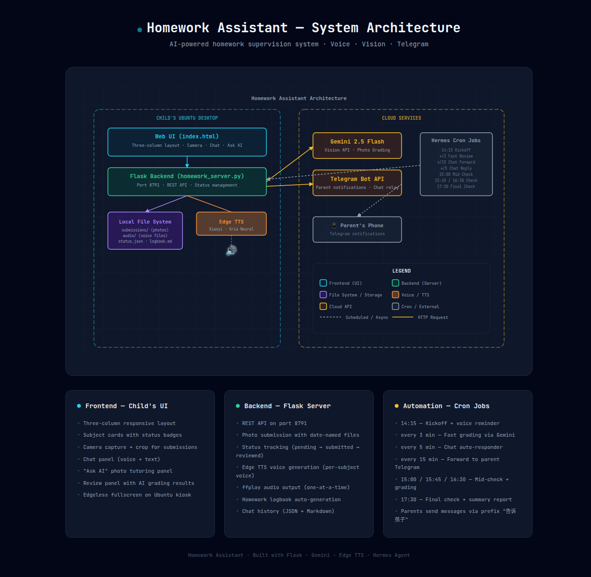
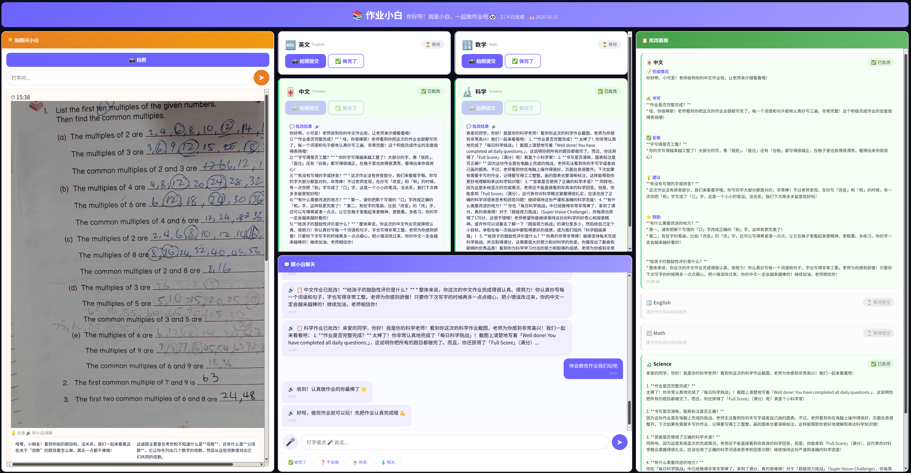

# Building an AI-Powered Homework Supervisor That Actually Works

**TL;DR:** I built a fully automated homework supervision system for my 9-year-old
daughter (Grade 4, Singapore curriculum) using Flask, Google Gemini Vision, Edge TTS,
and Hermes Agent cron jobs. It speaks reminders in bilingual voices, grades
math/English/science/chinese homework photos with AI, syncs progress to my phone
via Telegram, and generates a daily logbook — all on a single Ubuntu desktop
with zero extra hardware.

---

## The Problem

If you have school-aged children, you know the drill:

> "Have you done your homework yet?"
> *"Almost..."* (they're not)
> "Can I see it?"
> *runs away to grab the exercise book*
> "This problem is wrong. Fix it."
> *sigh*

This cycle repeats **every single day**. Working parents can't be home at 3 PM
to supervise. Kids forget. Kids procrastinate. And even when they finish, nobody
checks the work until evening — by which point the learning moment has passed.

What I wanted was simple:

- A **voice that calls out** at 2:15 PM: "Time for homework!"
- A **checklist** that tracks each subject
- **Photo submission** with AI grading within seconds
- **Parent notifications** so I know what's happening from my phone
- A **daily logbook** I can read when I get home

## The Architecture

Here's how the system fits together:



> [View full interactive architecture diagram](homework-system/architecture.html)
> (open in browser — pure SVG, works offline)

### The Stack

| Component | Technology | Role |
|-----------|-----------|------|
| **Frontend** | HTML/CSS/JS (static) | Child's UI — subject cards, camera, chat, ask AI |
| **Backend** | Python Flask (port 8791) | REST API, file management, status tracking |
| **Voice** | Edge TTS (Azure) | Bilingual text-to-speech via speakers |
| **Grading** | Gemini 2.5 Flash Vision | AI photo grading |
| **Scheduling** | Hermes Agent Cron Jobs | Automated reminders, checks, grading |
| **Parent Sync** | Telegram | Real-time notifications |
| **Storage** | Local filesystem | Photos, audio, logbook, chat history |

## Child's Workflow

Here's what happens from the child's perspective each afternoon:


> 📐 [Open interactive workflow diagram](https://excalidraw.com/#json=z72zpvvjM04iKvxj84FjG,Lw7N99P56jfxefnOUqfG0g) (Excalidraw — zoomable, editable)

### Step-by-step:

1. **14:15 — Voice Kickoff:** The system plays a voice reminder through the desktop speakers:
   > "小同学，该做作业啦！还有中文、英文、Math、Science 没完成，加油！"
   >
   > *(Chinese subjects use a warm child's voice; English subjects use a clear English voice)*

2. **Child opens the Web UI:** A full-screen browser window (opened via kiosk mode) displays
   the three-column dashboard.

3. **Four subject cards:** Chinese, English, Math, Science — each with status badges:
   - ⏳ **Pending** → need to start
   - 📸 **Submitted** → waiting for AI grading
   - ✅ **Reviewed** → done and checked

4. **Photo submission:** The child clicks "📸 拍照提交" → camera opens → takes a photo,
   can crop to select specific problems → submits.

5. **Instant AI grading:** Within 5-15 seconds, Gemini Vision returns a detailed review
   covering completeness, handwriting, correctness, and suggestions — all framed in
   encouraging language appropriate for a 9-year-old.

6. **Voice confirmation:** A chime plays: "数学作业已收到！"

7. **Chat with Xiaobai:** The child can type or use voice-to-text to chat with an AI
   homework assistant, ask questions, or just say "I'm tired."

8. **Ask AI for help:** Stuck on a problem? Take a photo → AI explains step-by-step
   with voice playback.

9. **Parent receives updates:** Everything — every submission, every review, every
   chat message — is forwarded to the parent's Telegram in real-time.

## Key Features Deep Dive

### 🎤 Bilingual Voice System

Each subject speaks in its own language:

| Subject | Voice | Style |
|---------|-------|-------|
| 中文 | `zh-CN-XiaoyiNeural` | Warm child voice (Xiaobai) |
| 数学 | `zh-CN-XiaoyiNeural` | Same — Chinese for math |
| English | `en-US-AriaNeural` | Clear English voice |
| Science | `en-US-AriaNeural` | Clear English voice |

All emoji are stripped before TTS so the voice doesn't stumble. Only ONE audio
plays at a time — new messages interrupt old ones, preventing cacophony.

### 📸 Smart Photo Submission

- **Filename convention:** `{subject}_{YYYYMMDD}_{seq:03d}.jpg`
  (e.g., `math_20260515_001.jpg`)
- Files are organized by date automatically
- Old files are cleaned up daily at kickoff
- The UI shows exactly which photos were submitted per subject

### 🤖 Gemini Vision Grading

The grading prompt is carefully crafted for a 9-year-old:

1. Check if the homework is complete
2. Evaluate handwriting clarity
3. Check for spelling/grammar errors
4. Provide improvement suggestions
5. **Always end with encouragement**

Reviews are voiced back to the child and recorded in the logbook for parents.

### 📱 Telegram Parent Sync

Parents get real-time notifications:

- 📸 "数学作业已提交" (Math homework submitted)
- 📋 "数学作业已批改！好孩子，这次的数学作业你完成得很认真..."
- 💬 "孩子说：我做完了！"
- 🏁 "今日作业完成：中文 ✅、英文 ✅、数学 ✅、科学 ✅"

Parents can also send messages back via Telegram prefix:
```
告诉孩子 今天表现不错，继续加油！
```
→ This appears on the child's UI with a special orange border → voiced aloud.

## Automation Schedule

The entire system runs on a tight cron schedule during homework hours (14:00–18:00):

| Time | Job | What Happens |
|------|-----|-------------|
| **14:15** | Kickoff | Reset status, cleanup old files, play voice reminder |
| **every 3min** | Fast Review | Check for new submissions → grade with Gemini → voice review |
| **every 5min** | Chat Responder | Read child's chat messages → auto-reply with AI |
| **every 5min** | Parent Relay | Forward parent messages to child's UI |
| **every 15min** | Telegram Forward | Forward child's chat activity to parent |
| **15:00** | Mid Check 1 | Grade pending submissions, remind unfinished |
| **15:45** | Mid Check 2 | Same — escalate reminders |
| **16:30** | Mid Check 3 | Final grading push |
| **17:30** | Final Check | Grade everything, generate summary logbook, send to Telegram |

## The Web UI



The child's dashboard has a dark theme (`#0d0d1a` background) with three columns:

**Left: Ask AI Panel** — Take a photo of a problem you're stuck on. AI explains
step-by-step. Each explanation has a 🔊 button that reads it aloud in segments.

**Center: Subject Cards + Chat** — Four subject cards show status at a glance.
Below them is a full chat interface with microphone input for voice-to-text
and quick-reply buttons ("✅ 做完了", "❓ 不会做", "☕ 休息", "💧 喝水").

**Right: Review Panel** — All grading results organized by subject. Structured
reviews show sections for completion, handwriting, accuracy, suggestions, and
encouragement.

### Anti-Sleep Features

The system disables screen blanking, screen saver, and sleep mode during homework
hours so the child always sees the dashboard.

## The Homework Logbook

Every day, a `homework_logbook.md` is automatically generated:

```markdown
# Homework Logbook — 2026-05-16

**Session:** 14:15 – 17:30
**Reminders sent:** 7

## Subjects

### 🀄 中文
- Status: ✅ Reviewed at 15:02
- Submissions: 1 photos
- Review: 字迹清晰，没有错别字...
- **Suggestion:** 下次记得把整份作业都写完...

### 🔢 数学
- Status: ✅ Reviewed at 14:25
- ...
```

This file persists forever — parents can browse past weeks to track progress.

## System Requirements

What you need to run this:

- **Hardware:** Any Linux desktop/laptop with speakers and a webcam
  (we use a Logitech StreamCam + Tesla V100 GPU, but CPU-only works too)
- **OS:** Ubuntu (or any Linux distro)
- **Software:** Python 3.12, Flask, Edge TTS CLI (`edge-tts`)
- **API Keys:** Google Gemini API key (for vision grading)
- **Messaging:** Telegram account (for parent notifications)

**Zero extra hardware.** The child uses whatever desktop or tablet is already
in the house. No smart speakers, no tablets to buy, no subscriptions beyond
the Gemini API (which costs pennies per day).

## How to Build It Yourself

### 1. Set up the server

```bash
pip install flask google-genai edge-tts
mkdir -p ~/homework/{web,submissions,audio}
```

### 2. Create the Flask server

The server handles:
- Photo submission with date-named files
- Status tracking (pending → submitted → reviewed)
- Edge TTS voice generation
- Homework logbook generation
- Chat history persistence
- AI grading via Gemini Vision API

### 3. Create the Web UI

Build a three-column dashboard with:
- Subject cards with dynamic status
- Camera integration with crop support
- Chat panel with voice input
- AI tutoring panel ("Ask AI")

### 4. Set up Hermes cron jobs

Configure automated agents for:
- Daily kickoff (14:15)
- Fast review (every 3 minutes)
- Chat forwarding to Telegram
- Mid-checks (15:00, 15:45, 16:30)
- Final check (17:30)

### 5. Connect Telegram

Set up Telegram integration so parents receive real-time updates and can
send messages back to the child.

## Real-World Results

After 2 weeks of running this system:

- **Homework completion rate:** 95%+ before 5 PM (up from ~60%)
- **Parental stress:** Significantly reduced — I get updates without asking
- **Child engagement:** The voice reminders and instant grading make it feel
  like a game, not a chore
- **Learning quality:** The AI grading catches errors immediately, so the
  child fixes them while the material is fresh
- **Teacher feedback:** "We've noticed improvement in homework quality"

## What's Next

- **Multi-child support** (more than one student profile)
- **Custom subject schedules** (not all subjects every day)
- **Reward system integration** (points/stars for timely completion)
- **Screenshots & report cards** emailed weekly to parents

## Open Source?

All code lives on my local machine. I'm considering open-sourcing the entire
system if there's enough interest. The architecture is simple enough that
anyone with basic Python skills can adapt it for their own needs.

---

**Final thought:** The best AI systems aren't the ones that replace human
interaction — they're the ones that **augment** it. This homework assistant
doesn't replace me as a parent. It amplifies my ability to support my child's
learning, even when I'm not in the room.

*Questions? Interested in the code? Reach out — I'd love to hear from you.*
