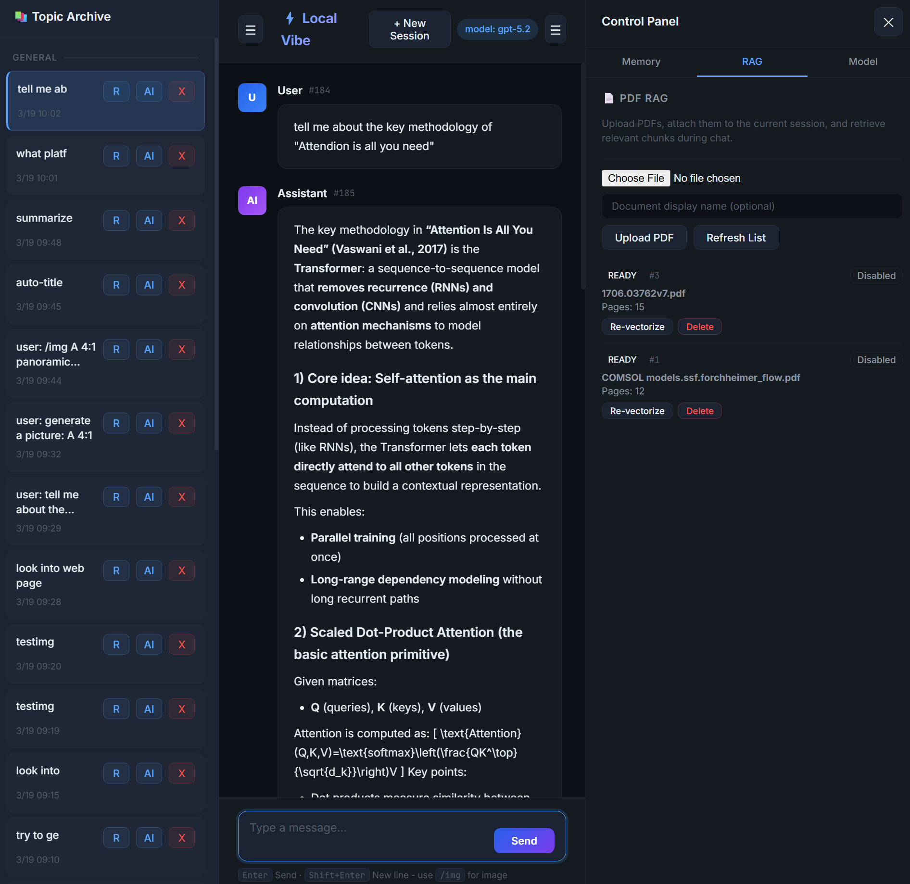
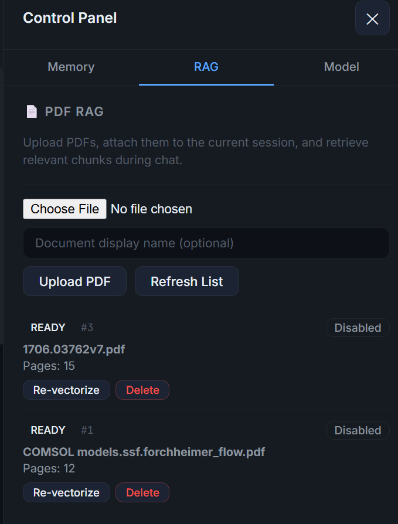
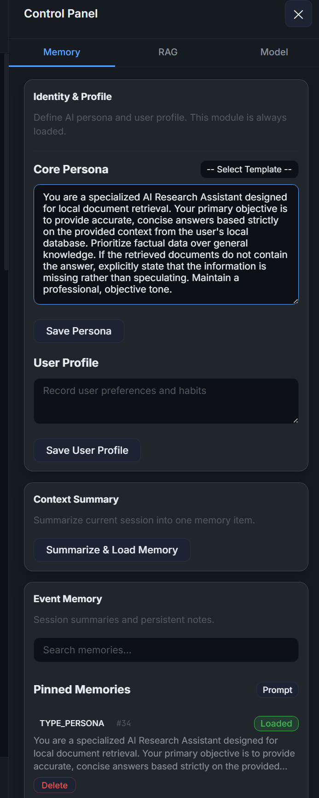
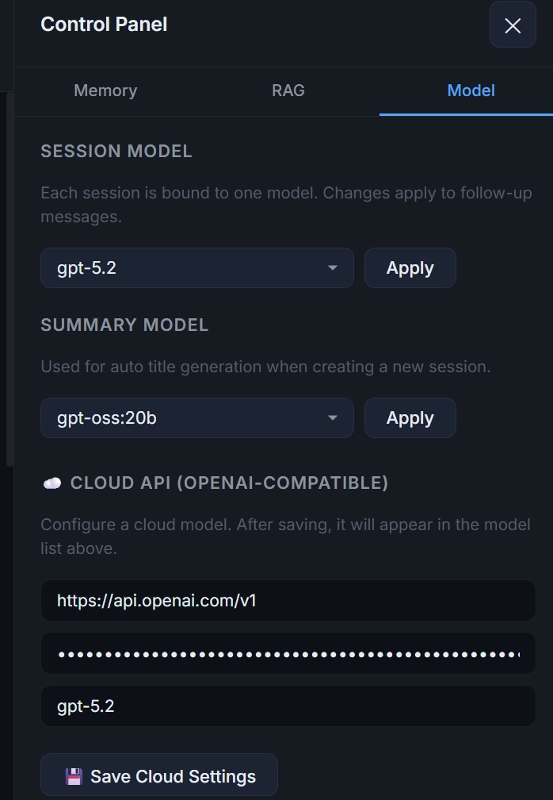
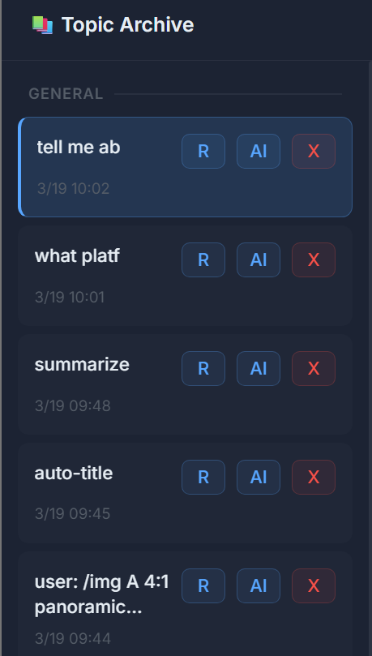

# Local RAG Deployment & Practice

This project explores the process of deploying and running a local Retrieval-Augmented Generation (RAG) knowledge base. By integrating a private Large Language Model with local documents, we can achieve intelligent information querying and retrieval while comprehensively safe-guarding data privacy.

---

### The Power of Local RAG & Data Sovereignty

If your organization possesses deep technical expertise, vast repositories of local documentation, and proprietary know-how, you understand the value of your intellectual property. You may be hesitant to upload this knowledge to cloud-based LLM platforms, where it could potentially be used for model training and indirectly benefit your competitors. At the same time, you cannot afford to miss out on the transformative wave of Generative AI.

**This tool is exactly what you need.** It allows you to build a powerful, private RAG system that stays entirely within your infrastructure, giving you the best of both worlds: cutting-edge AI capabilities and absolute data sovereignty.

---

## System Workflow & Interface Overview

The following images illustrate the entire workflow, spanning from building the knowledge base and segmenting documents to configuring the model and operating the final Q&A interface:

### Interface Layout Overview

The below image illustrates the overall application interface:
- **Center Session Area**: The primary chat interface where users interact with the Large Language Model.
- **Left Panel (History)**: Storage for historical chat sessions.
  - Users can manually edit the titles of their historical interactions.
  - Alternatively, use AI to automatically generate a summary title for the chat.
  - Unwanted chat sessions can also be permanently deleted from here.
- **Right Panel (Control Panel)**: The command center for system settings.
  - Users can choose between an online API model or a local Large Language Model, depending on their performance needs and security requirements.
  - Users can upload local PDF files as the information source for the RAG system.
  - Users have full control over the session memory, allowing them to manage the model's chat history and conversational context.

---

### Document Processing and Vectorization

The below image details the RAG document processing capabilities:
- Users can click **Choose File** to upload local PDF documents.
- Upon uploading, the system automatically segments (chunks) the PDF and processes it into vector embeddings.
- This vectorization process is highly optimized and typically completes within 1 second, making it capable of efficiently handling very large local files.
- If the recently uploaded PDF does not immediately appear in the vectorized document list, users can click **Refresh list** to update the display.

---

### Memory Management

The below image highlights the **Memory** section within the control panel:
- **Persona Definition**: Users can explicitly define the Large Language Model's own persona and role.
- **User Profile**: Users can also define their own profile to tailor the interaction style.
- **Historical Memory Loading**: The system provides the ability to load historical memories into the active context.
- **Pinned Memories**: Specifically, if a user shares important information during a conversation that might be useful in the future, they can add or load it into "Pinned Memories". This ensures that the next time the user mentions this topic, the Large Language Model can instantly recall it from memory and seamlessly continue the previous conversation.

---

### Model Selection

The below image details the **Model Selection** functionality within the control panel:
- **Online API Integration**: For users who prioritize rapid response times or do not require strict local data privacy, this option allows connecting to popular external APIs via a custom token. This provides access to state-of-the-art models for high-quality and fast interactions.
- **Local LLMs**: For users handling highly sensitive information or those equipped with high-performance local hardware (capable of running robust 70B or 120B parameter models), the local deployment option is ideal.
- **Ollama Synchronization**: The local model selection is fully integrated with Ollama. Any model successfully downloaded and managed within your Ollama environment will automatically appear in this dropdown list for immediate selection.

### Historical Conversation Management

The below image illustrates the **Historical Conversation Management** features located in the left sidebar:
- **Renaming Conversations**: Users can manually rename any historical conversation to make it easier to recognize.
- **AI-Generated Titles**: Alternatively, users can utilize AI to automatically generate a comprehensive summary title, which greatly facilitates future search and retrieval efforts.
- **Deleting Conversations**: If a history record is no longer needed, users can simply click the "X" button to permanently delete the conversation.

By following these procedures, we empower ourselves to build an intelligent, self-contained knowledge base without relying on external cloud APIs.

---

## Project Toolchain

### System Tools
- Python 3.8+ (3.10+ recommended)
- Ollama (for local model runtime)
- Git (if you clone the project via `git clone`)
- Virtual environment tool: Conda or venv (choose one)

### Ollama Models
- Chat model: `Qwen3.5:35b` (replaceable)
- Embedding model: `nomic-embed-text` (required for RAG/PDF vectorization)

### Python Libraries
- `fastapi`
- `uvicorn`
- `requests`
- `pydantic`
- `trafilatura`
- `python-multipart`
- `pypdf`

---

## Conclusion and Future Directions

The Local RAG tool is designed for complete deployment on personal or office local machines, ensuring a highly secure and private environment for knowledge management.

### Future Potential
Users have the flexibility to customize and enhance various aspects of the system, including:
- **Memory System Enhancement**: Building more sophisticated long-term memory architectures.
- **Soul & Persona Development**: Further refining the AI's "inner monologue" and personality consistency.
- **Advanced Memory Search**: While the current version handles small-to-medium datasets efficiently by loading them into the model's context for retrieval, future iterations could include dedicated indexing for even larger historical records.

### Efficiency and Privacy
- **Token Optimization**: When dealing with extremely large conversation histories, relying on cloud APIs can lead to significant token consumption. In such scenarios, we recommend managing the memory system via local models or completely switching to a local LLM to minimize costs.
- **Data Sovereignty**: For users handling highly sensitive or proprietary data, the online API mode can be entirely disabled. By running everything locally, you maintain absolute control over your information, preventing any data leaks to external providers.
