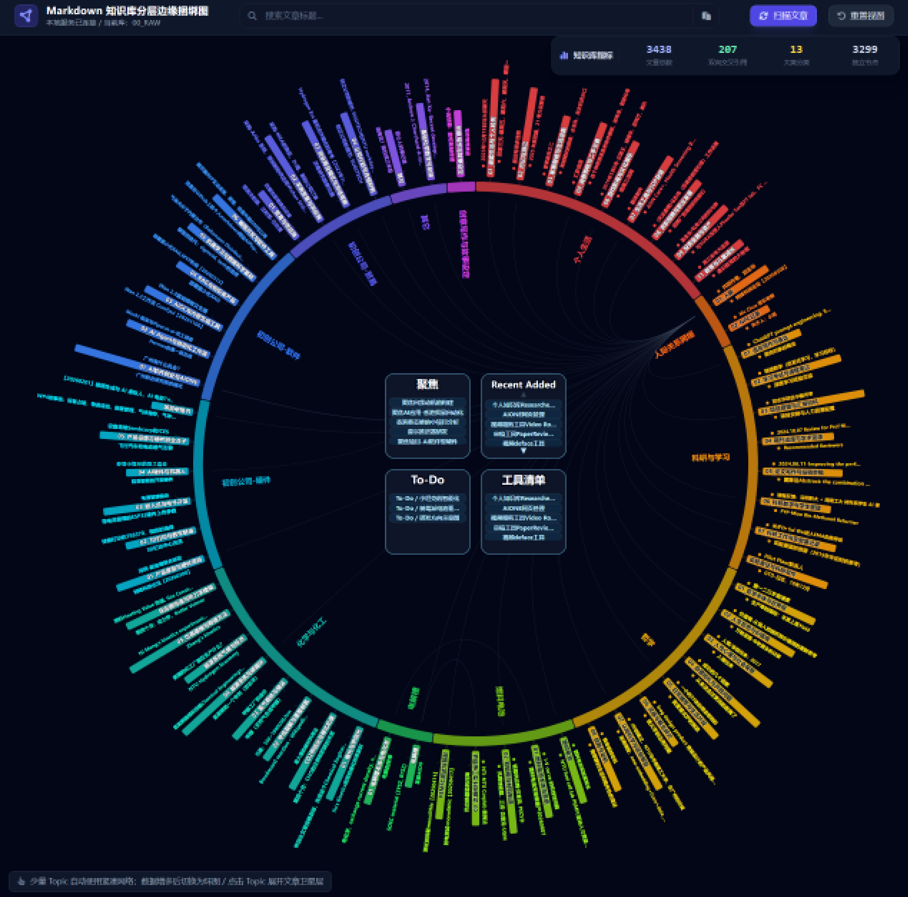

# Personal Knowledge Base Managed by AI Agents

<video autoplay muted loop playsinline preload="auto" tabindex="-1" draggable="false" oncontextmenu="return false;" aria-label="Personal knowledge base demonstration" style="display:block; width:1896px; max-width:100%; height:auto; margin:0 auto 2rem; border-radius:14px; background:#050816; pointer-events:none; user-select:none;">
  <source src="../../assets/videos/personal-knowledge-base-demo.mp4" type="video/mp4">
  Your browser does not support embedded video playback.
</video>

This project is a personal knowledge base management system designed for people who need to organize a large and continuously growing collection of documents, notes, papers, and ideas.

Instead of treating an AI assistant as a one-off question-answering tool, the system allows different mainstream AI Agents—running locally or remotely—to act as an ongoing knowledge librarian. Agents can ingest documents, classify articles, discover semantic relationships, create links between related topics, and help users find the right information through natural-language search.

## What the system can do

- **Automatic classification:** Organize newly added articles and documents into meaningful categories.
- **Semantic search:** Find relevant knowledge by meaning and context, even when the search terms do not exactly match the original text.
- **Knowledge linking:** Identify relationships between documents and build a navigable network of related ideas.
- **Agent-assisted maintenance:** Ask an AI Agent to summarize, reorganize, update, or audit the knowledge base.
- **Local or remote operation:** Use locally hosted Agents for privacy and control, or remote Agents for convenience and access to larger models.

## Why it matters

Traditional folders and keyword search become increasingly difficult to manage as the volume of information grows. This approach turns a static document collection into a living knowledge network: new material can be processed automatically, existing knowledge can be connected, and important information can be retrieved without remembering the exact title or wording of a document.

The system is especially suitable for small companies, independent researchers, laboratories, and technical teams that need to manage a substantial body of documents without the overhead of a large enterprise knowledge-management platform.

## A flexible Agent layer

The knowledge base is not tied to a single AI vendor. Different Agents can be assigned different roles—for example, one Agent can process incoming documents, another can perform research and semantic retrieval, and another can review the structure for duplicate or disconnected content. This makes the system adaptable as models, tools, and deployment environments evolve.

The result is a practical, searchable, and continuously improving knowledge workspace managed with the help of AI.
