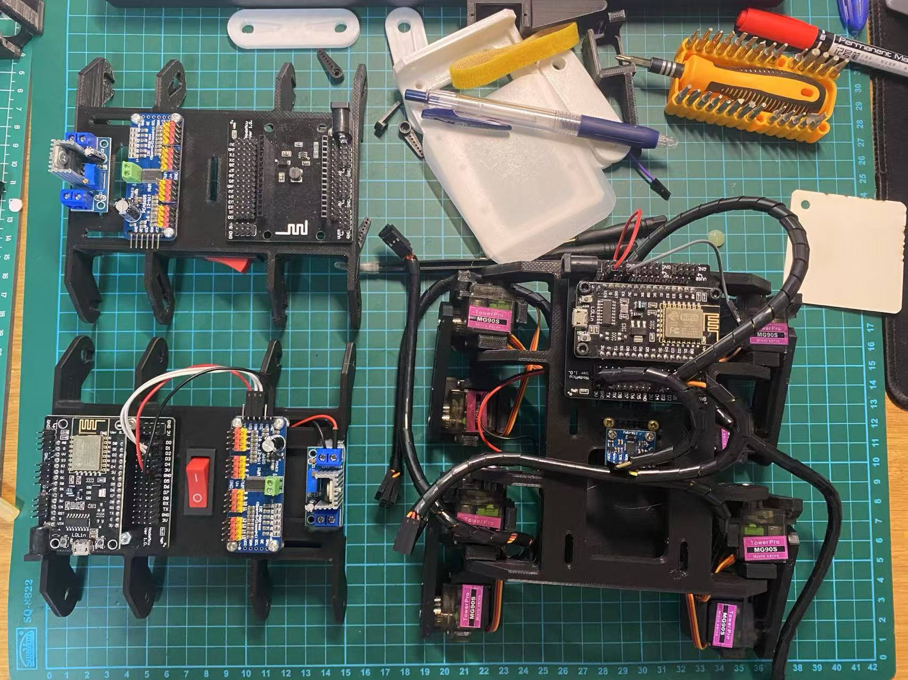
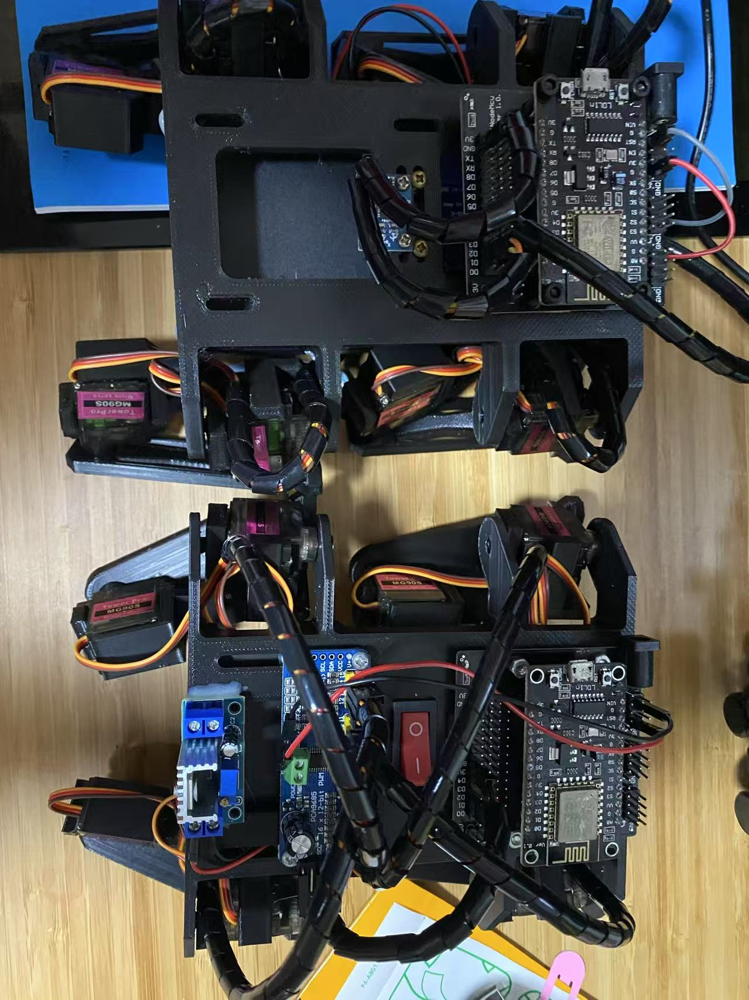
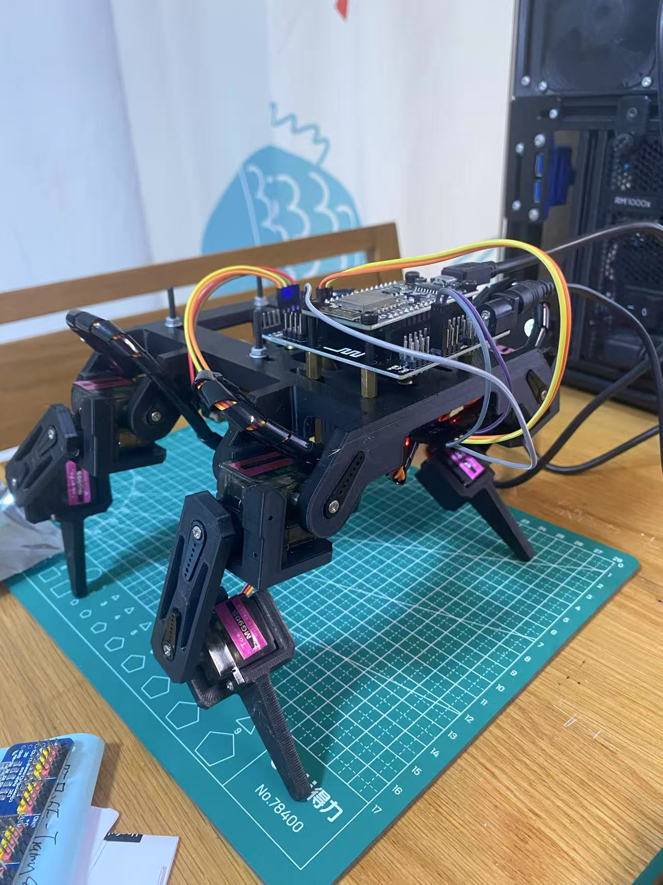

# Quadruped Robot

An experimental AI-assisted walking robot:

| Module      | Description                    |
|-------------|--------------------------------|
| Locomotion  | 4-legged servo structure       |
| Brain       | Microcontroller + IMU          |
| Goals       | Stability, gait learning       |

## Gallery

  

    
    

      <h3 class="gallery-card-title">Initial Frame</h3>
    

  

  

    
    

      <h3 class="gallery-card-title">Walking Test</h3>
    

  

  

    
    

      <h3 class="gallery-card-title">AI Gait Control</h3>
    

  

<!-- Overlay / Modal -->

  

    <button class="gallery-close" onclick="closeGalleryModal()" aria-label="Close">&times;</button>
    
    <h2 class="gallery-modal-title" id="gModalTitle"></h2>
  

## Hardware & Engineering Design

We have custom-designed an ultra-low-cost robotic dog based entirely on widely available SG90 micro servos. The core calculation unit is powered by either an ESP8266 or an ESP32 microcontroller, depending on the computational load. 

To maintain balance and acquire real-time postural data, we integrated an MPU6050 gyroscope and accelerometer. The 12 independent robot joints are driven by a dedicated 16-channel PCA9685 PWM driver board. 

**Power Challenge:** Delivering sufficient and stable current to 12 servos simultaneously under load is a significant challenge. It requires a dedicated, robust voltage regulation controller to prevent brownouts and jittering.

## Software & Kinematics

On the software side, the entire system is programmed in **MicroPython**. We developed a standalone custom **Inverse Kinematics (IK)** engine from scratch to calculate the precise joint angles required to position the robot's feet to desired coordinates in 3D space, which is critical for generating stable walking gaits.

## Future Plans

- **Power Management:** Implement a dedicated power control IC and an improved voltage regulator to handle peak servo current spikes effectively.
- **Upgraded Brain:** Transition entirely to more powerful computing units (e.g., ESP32-S3 or better) to handle advanced algorithms natively.
- **AI-Driven Gait Synthesis:** Let an AI Agent take over the design and optimization of the Inverse Kinematics and generate several standard walking gait algorithms dynamically. 
- **Remote Control Integration:** Add a dedicated handheld remote controller for easier testing and demonstration.
- **Vision Subsystem (Long-Term):** Eventually add a camera for computer vision tasks (object tracking, obstacle avoidance). However, this must be carefully balanced against the additional power draw and weight.
