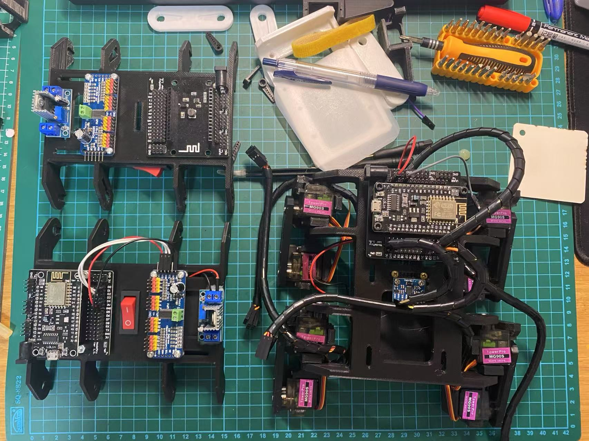

# Quadruped Robot

An experimental AI-assisted walking robot:

| Module      | Description                    |
|-------------|--------------------------------|
| Locomotion  | 4-legged servo structure       |
| Brain       | Microcontroller + IMU          |
| Goals       | Stability, gait learning       |

## Gallery

<table>
  <tr>
    <td align="center">
       
      <strong>Initial Frame</strong>
    </td>
    <td align="center">
       
      <strong>Walking Test</strong>
    </td>
    <td align="center">
       
      <strong>AI Gait Control</strong>
    </td>
  </tr>
</table>
