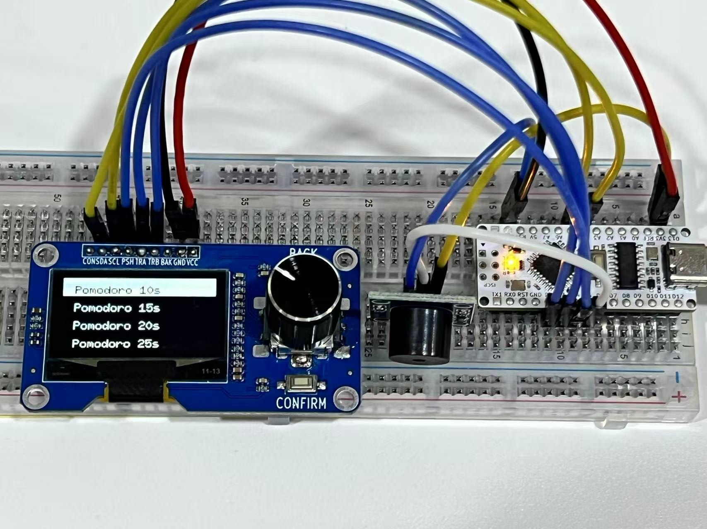

# Pomodoro Timer Project

This project showcases a simple yet effective Pomodoro timer built with an ESP32 microcontroller and an OLED display. It features a rotary encoder for selecting duration, automatic countdown, and buzzer alerts.

---

## 🧰 Hardware Components

- ESP32-C3 SuperMini development board
- 0.91" I2C OLED display
- EC11 rotary encoder (with button)
- Passive buzzer module
- Breadboard + jumper wires
- 3.7V Li-ion battery + switch module



---

GPT Prompt for the Code:
In this project, we built a Pomodoro timer using an Arduino Nano, a 1.3-inch I2C OLED display (SH1106-based), an EC11 rotary encoder with a push button, and a low-level triggered passive buzzer module.

The timer features a scrollable menu interface, allowing users to select from the following options:

Pomodoro 10s
Pomodoro 15s
Pomodoro 20s
Pomodoro 25s
Info

Only four menu items are shown on screen at a time, and the encoder is used to scroll through the options. The selected menu item is highlighted with inverted colors using the U8g2 graphics library, which also handles all display rendering.

Pressing the encoder button triggers an action:

For Pomodoro options: A countdown begins, displayed in large digits at the center of the screen using a bold font. After the countdown ends, a “Done!” message flashes several times, and the passive buzzer beeps three times.

For the "Info" option: A brief information page is displayed (e.g., author name and date).

All encoder input is handled with digitalRead polling (no interrupts), and the menu scrolls smoothly within the bounds of available options. The buzzer is triggered by sending LOW signals to match its low-level activation design.

This compact project demonstrates interactive UI handling, I2C display control, rotary encoder input, and timed output events—all within the Arduino ecosystem.

---

## 🧠 Key Code Snippet

<details>
<summary>Click to expand full code</summary>
```cpp
#include <U8g2lib.h>
#include <Wire.h>

U8G2_SH1106_128X64_NONAME_F_HW_I2C u8g2(U8G2_R0);

const int CLK = 2;
const int DT  = 3;
const int SW  = 4;
const int buzzerPin = 5; // Buzzer IN

const int menuCount = 5;
const char* menuItems[menuCount] = {
  "Pomodoro 10s", 
  "Pomodoro 15s", 
  "Pomodoro 20s", 
  "Pomodoro 25s", 
  "Info"
};

int menuIndex = 1;
int lastCLK = HIGH;
//===========================================================
void setup() {
  pinMode(CLK, INPUT_PULLUP);
  pinMode(DT, INPUT_PULLUP);
  pinMode(SW, INPUT_PULLUP);
  pinMode(buzzerPin, OUTPUT);
  digitalWrite(buzzerPin, LOW); // initialized as LOW

  u8g2.begin();
  drawMenu();
}

void loop() {
  int currentCLK = digitalRead(CLK);
  if (currentCLK != lastCLK && currentCLK == LOW) {
    if (digitalRead(DT) != currentCLK) {
      menuIndex++;
    } else {
      menuIndex--;
    }
    if (menuIndex < 1) menuIndex = 1;
    if (menuIndex > menuCount) menuIndex = menuCount;
    drawMenu();
  }
  lastCLK = currentCLK;

  if (digitalRead(SW) == LOW) {
    delay(200);
    handleSelection(menuIndex);
    drawMenu();
  }
}
//===========================================================
void drawMenu() {
  u8g2.clearBuffer();
  u8g2.setFont(u8g2_font_6x10_tr);

  const int visibleCount = 4;
  int startIdx = menuIndex - 1;
  if (startIdx < 1) startIdx = 1;
  if (startIdx > menuCount - visibleCount + 1)
    startIdx = menuCount - visibleCount + 1;

  for (int i = 0; i < visibleCount; i++) {
    int idx = startIdx + i;
    if (idx > menuCount) break;

    int y = i * 16 + 14;
    if (idx == menuIndex) {
      u8g2.drawBox(0, i * 16, 128, 16);
      u8g2.setDrawColor(0);
    } else {
      u8g2.setDrawColor(1);
    }
    u8g2.setCursor(10, y);
    u8g2.print(menuItems[idx - 1]);
  }
  u8g2.setDrawColor(1);
  u8g2.sendBuffer();
}

void handleSelection(int index) {
  if (index >= 1 && index <= 4) {
    int seconds = 5 * index + 5;  // index=1 → 10, 2 → 15 ... 4 → 25
    for (int i = seconds; i >= 0; i--) {
      u8g2.clearBuffer();
      u8g2.setFont(u8g2_font_logisoso32_tr);
      String s = String(i);
      int textWidth = u8g2.getStrWidth(s.c_str());
      u8g2.setCursor((128 - textWidth) / 2, 45);
      u8g2.print(s);
      u8g2.sendBuffer();
      delay(1000);
    }
    flashDone();

  } else if (index == 5) {
    u8g2.clearBuffer();
    u8g2.setFont(u8g2_font_6x10_tr);
    u8g2.setCursor(10, 25);
    u8g2.print("Made by Miao");
    u8g2.setCursor(10, 40);
    u8g2.print("2025-05-15");
    u8g2.sendBuffer();
    delay(3000);
  }
}

// flash finish
void flashDone() {
  for (int i = 0; i < 4; i++) {
    u8g2.clearBuffer();
    u8g2.setFont(u8g2_font_ncenB14_tr);
    String text = "Done!";
    int w = u8g2.getStrWidth(text.c_str());
    u8g2.setCursor((128 - w) / 2, 40);
    u8g2.setDrawColor(1);
    u8g2.print(text);
    u8g2.sendBuffer();
    digitalWrite(buzzerPin, HIGH); // buzzer sound
    delay(300);

    u8g2.clearBuffer();
    u8g2.drawBox(0, 0, 128, 64);
    u8g2.setDrawColor(0);
    u8g2.setCursor((128 - w) / 2, 40);
    u8g2.print(text);
    u8g2.sendBuffer();
    digitalWrite(buzzerPin, LOW); // buzzer sound
    delay(300);
  }
  u8g2.setDrawColor(1);
}

```
</details>
---

Now, once your code is running, you can replace the handleSelection function to the follow to change the Pomodo time interval.

<details>
<summary>Click to expand full code</summary>
```cpp
void handleSelection(int index) {
  if (index >= 1 && index <= 4) {
    int minutes[] = {10, 15, 20, 25};
    int seconds = minutes[index - 1] * 60; // This 60 is the key for unit change.

    for (int i = seconds; i >= 0; i--) {
      u8g2.clearBuffer();
      u8g2.setFont(u8g2_font_logisoso32_tr);

      int min = i / 60;
      int sec = i % 60;
      char timeStr[6];
      sprintf(timeStr, "%02d:%02d", min, sec);

      int textWidth = u8g2.getStrWidth(timeStr);
      u8g2.setCursor((128 - textWidth) / 2, 45);
      u8g2.print(timeStr);
      u8g2.sendBuffer();
      delay(1000);
    }
    flashDone();
    beep3Times();
  } else if (index == 5) {
    u8g2.clearBuffer();
    u8g2.setFont(u8g2_font_6x10_tr);
    u8g2.setCursor(10, 25);
    u8g2.print("Made by Miao");
    u8g2.setCursor(10, 40);
    u8g2.print("2025-05-15");
    u8g2.sendBuffer();
    delay(3000);
  }
}

```
</details>
---

## 🎬 Video Demonstrations

### Version 1: Basic Functionality Overview

<iframe width="100%" height="315" src="https://www.youtube.com/embed/8o0xLZvq88A" frameborder="0" allowfullscreen></iframe>

---

### Version 2: Rotary Control + Buzzer Feedback

<iframe width="100%" height="315" src="https://www.youtube.com/embed/vNcMjf2bBhE" frameborder="0" allowfullscreen></iframe>
