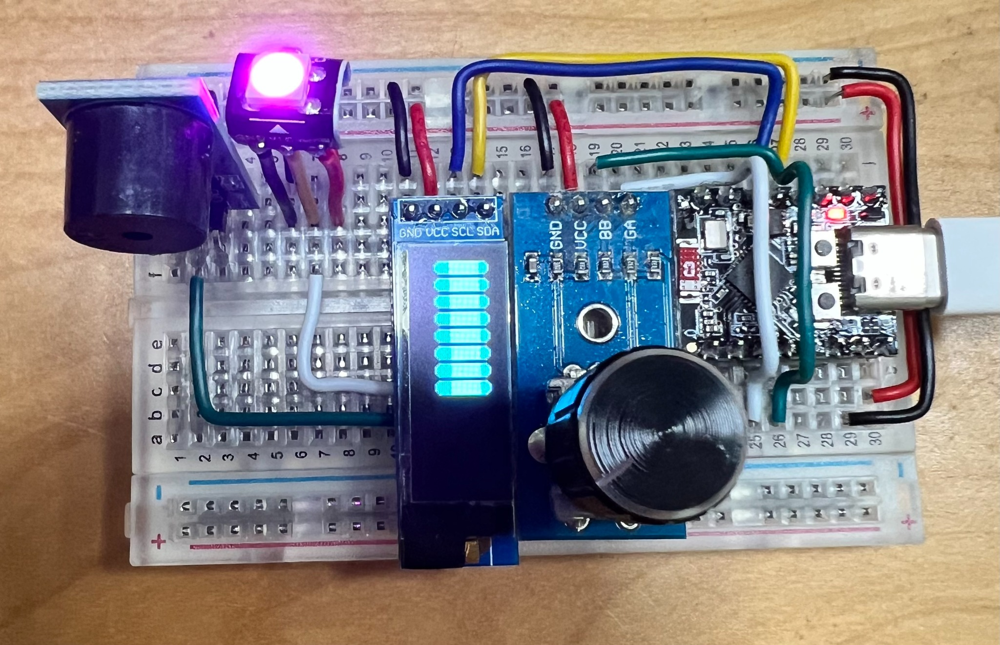

# Pomodoro Timer Project

This project showcases a simple yet effective Pomodoro timer built with an ESP32 Supermini and an OLED display. It features a rotary encoder for time bar control, time bar shrinkage, and final alarm text.

---

## 🧰 Hardware Components

- ESP32-C3 SuperMini development board
- 0.91" I2C OLED display
- buzzer
- WS2812 RGB LED
- EC11 rotary encoder (with button)
- Breadboard + jumper wires


---

GPT Prompt for the Code:
I have an ESP32-C3 SuperMini development board, a 0.91" OLED display (128x32, I2C interface), a single EC11 rotary encoder (without a soldered button), a passive buzzer connected to GPIO1, and a single WS2812 RGB LED connected to GPIO0.

I want to build a visual Pomodoro-style timer using Arduino. Please implement the following behavior using the U8g2 library for OLED, the Encoder library for the rotary encoder, and the Adafruit_NeoPixel library for the WS2812 LED:

Display & Timer Behavior
The screen shows a horizontal progress bar composed of evenly spaced blocks.

Each block is 8 pixels wide, with 2 pixels spacing between blocks.

Each block has its four corners cut, like a 3-pixel right-angle triangle, removing three pixels in each corner to create a high-tech cut-corner visual effect.

When rotating the encoder:

Clockwise: one block is added (up to screen width);

Counterclockwise: one block is removed from the right.

Inactivity Response
If no interaction happens for 2 seconds, the entire progress bar flashes 5 times (on/off every 200ms).

After flashing, the progress bar automatically shrinks, one block at a time from right to left.

Each block flashes in a “half-flash” pattern before disappearing:

Only half of the pixels inside the block are lit (checkerboard pattern);

The block corners remain unlit during the flash, preserving the cut-corner look.

End State
When all blocks are gone:

The screen displays “Done!” in large 32-pixel font (u8g2_font_logisoso32_tf), centered.

The buzzer (GPIO1) beeps 3 times (short pulse).

The WS2812 LED (GPIO0) is turned off.

After 5 seconds, the display is cleared and the LED remains off.

LED Color Feedback
As the encoder rotates, the WS2812 LED cycles through hues in the RGB color wheel.

Clockwise = forward through hues, counterclockwise = backward.

The LED should show smooth color transitions and update in real-time with the encoder.

Notes
Use U8g2lib.h, Encoder.h, and Adafruit_NeoPixel.h.

OLED screen should be updated efficiently.

All visual and interactive transitions should feel responsive and smooth.

---

## 🧠 Key Code Snippet

<details>
<summary>Click to expand full code</summary>
```cpp
#include <Arduino.h>
#include <U8g2lib.h>
#include <Encoder.h>
#include <Adafruit_NeoPixel.h>

#define SCREEN_WIDTH 128
#define SCREEN_HEIGHT 32
#define BLOCK_WIDTH 8
#define BLOCK_SPACING 2
#define BLOCK_TOTAL_WIDTH (BLOCK_WIDTH + BLOCK_SPACING)
#define MAX_BLOCKS (SCREEN_WIDTH / BLOCK_TOTAL_WIDTH)

#define ENCODER_PIN_A 2
#define ENCODER_PIN_B 3
#define BUZZER_PIN 1
#define LED_PIN 0
#define LED_COUNT 1

U8G2_SSD1306_128X32_UNIVISION_F_HW_I2C u8g2(U8G2_R0);
Encoder knob(ENCODER_PIN_A, ENCODER_PIN_B);
Adafruit_NeoPixel pixel(LED_COUNT, LED_PIN, NEO_GRB + NEO_KHZ800);

// Status Variables
int numBlocks = 0;
int lastPosition = 0;
unsigned long lastInteraction = 0;
bool flashing = false;
int flashCount = 0;
bool flashVisible = true;
unsigned long lastFlashTime = 0;
bool shrinking = false;

// Blinking Variables
int blinkingBlockIndex = -1;
int blinkCount = 0;
bool blinkVisible = true;
unsigned long lastBlinkTime = 0;
const int maxBlinkCount = 6;

// Color Variables
int hueValue = 0;

// Finishing Screen Control
unsigned long doneTime = 0;
bool doneDisplayed = false;

// ========================= Functions =========================

void updateColor() {
  pixel.setPixelColor(0, pixel.ColorHSV(hueValue * 256));
  pixel.show();
}

void playBuzzer(int times) {
  for (int i = 0; i < times; i++) {
    digitalWrite(BUZZER_PIN, HIGH);
    delay(150);
    digitalWrite(BUZZER_PIN, LOW);
    delay(100);
  }
}

// 绘制带直角三角切角的格子
void drawCutCornerBlock(int x, int y, int w, int h) {
  u8g2.drawBox(x, y, w, h);
  u8g2.setDrawColor(0); // 清除角落像素（三角形）

  // 左上
  u8g2.drawPixel(x, y);
  u8g2.drawPixel(x + 1, y);
  u8g2.drawPixel(x, y + 1);

  // 右上
  u8g2.drawPixel(x + w - 1, y);
  u8g2.drawPixel(x + w - 2, y);
  u8g2.drawPixel(x + w - 1, y + 1);

  // 左下
  u8g2.drawPixel(x, y + h - 1);
  u8g2.drawPixel(x + 1, y + h - 1);
  u8g2.drawPixel(x, y + h - 2);

  // 右下
  u8g2.drawPixel(x + w - 1, y + h - 1);
  u8g2.drawPixel(x + w - 2, y + h - 1);
  u8g2.drawPixel(x + w - 1, y + h - 2);

  u8g2.setDrawColor(1);
}

void drawBar(int blocks, bool visible = true, int blinkIndex = -1, bool blinkOn = true, bool halfFlash = false) {
  u8g2.clearBuffer();

  if (blocks == 0 && !visible) {
    u8g2.setFont(u8g2_font_logisoso32_tf);
    u8g2.drawStr((SCREEN_WIDTH - u8g2.getStrWidth("Done!")) / 2, 32, "Done!");
  } else if (visible) {
    for (int i = 0; i < blocks; i++) {
      int x = i * BLOCK_TOTAL_WIDTH;

      if (i == blinkIndex && !blinkOn) {
        if (halfFlash) {
          for (int dx = 0; dx < BLOCK_WIDTH; dx++) {
            for (int dy = 0; dy < SCREEN_HEIGHT; dy++) {
              int px = x + dx;

              // 跳过四个角落的三个像素（三角形）
              bool skipCorner =
                (dx == 0 && (dy == 0 || dy == 1 || dy == SCREEN_HEIGHT - 1 || dy == SCREEN_HEIGHT - 2)) ||
                (dx == 1 && (dy == 0 || dy == SCREEN_HEIGHT - 1)) ||
                (dx == BLOCK_WIDTH - 1 && (dy == 0 || dy == 1 || dy == SCREEN_HEIGHT - 1 || dy == SCREEN_HEIGHT - 2)) ||
                (dx == BLOCK_WIDTH - 2 && (dy == 0 || dy == SCREEN_HEIGHT - 1));

              if (skipCorner) continue;

              if ((dx + dy) % 2 == 0) {
                u8g2.drawPixel(px, dy);
              }
            }
          }

        }
      } else {
        drawCutCornerBlock(x, 0, BLOCK_WIDTH, SCREEN_HEIGHT);
      }
    }
  }

  u8g2.sendBuffer();
}

// ========================= Main Loop =========================

void setup() {
  u8g2.begin();
  pixel.begin();
  pixel.setBrightness(80);
  updateColor();

  pinMode(BUZZER_PIN, OUTPUT);
  digitalWrite(BUZZER_PIN, LOW);

  drawBar(numBlocks);
  lastInteraction = millis();
}

void loop() {
  unsigned long now = millis();

  // 
  int position = knob.read() / 4;
  if (position != lastPosition) {
    int delta = position - lastPosition;
    lastPosition = position;
    numBlocks += delta;

    if (numBlocks < 0) numBlocks = 0;
    if (numBlocks > MAX_BLOCKS) numBlocks = MAX_BLOCKS;

    // 色彩渐变
    hueValue += delta * 5;
    if (hueValue < 0) hueValue += 256;
    if (hueValue >= 256) hueValue -= 256;
    updateColor();

    drawBar(numBlocks);
    lastInteraction = now;
    flashing = false;
    shrinking = false;
    blinkingBlockIndex = -1;
    doneDisplayed = false;
  }

  // 
  if (!flashing && !shrinking && (now - lastInteraction > 2000) && numBlocks > 0) {
    flashing = true;
    flashCount = 0;
    flashVisible = false;
    lastFlashTime = now;
  }

  if (flashing && (now - lastFlashTime > 200)) {
    flashVisible = !flashVisible;
    drawBar(numBlocks, flashVisible);
    lastFlashTime = now;
    if (!flashVisible) flashCount++;
    if (flashCount >= 5) {
      flashing = false;
      shrinking = true;
      blinkingBlockIndex = -1;
    }
  }

  // 
  if (shrinking) {
    if (blinkingBlockIndex == -1 && numBlocks > 0) {
      blinkingBlockIndex = numBlocks - 1;
      blinkCount = 0;
      blinkVisible = false;
      lastBlinkTime = now;
    }

    if (blinkingBlockIndex >= 0 && (now - lastBlinkTime > 200)) {
      blinkVisible = !blinkVisible;
      lastBlinkTime = now;
      blinkCount++;

      drawBar(numBlocks, true, blinkingBlockIndex, blinkVisible, true);

      if (blinkCount >= maxBlinkCount) {
        numBlocks--;
        blinkingBlockIndex = -1;

        if (numBlocks == 0) {
          drawBar(0, false);
          shrinking = false;
          playBuzzer(3);
          pixel.clear();
          pixel.show();
          doneTime = millis();
          doneDisplayed = true;
        }
      }
    }
  }

  // Done 
  if (doneDisplayed && millis() - doneTime > 5000) {
    u8g2.clear();
    u8g2.sendBuffer();
    pixel.clear();
    pixel.show();
    doneDisplayed = false;
  }

  delay(10);
}

```
</details>
---

## 🎬 Video Demonstrations

### Version 1: Basic Functionality Overview

<iframe width="100%" height="315" src="https://www.youtube.com/embed/My10i8K1-sc" frameborder="0" allowfullscreen></iframe>

---