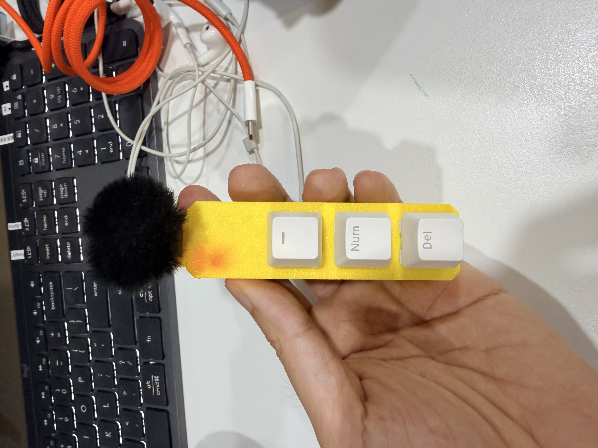
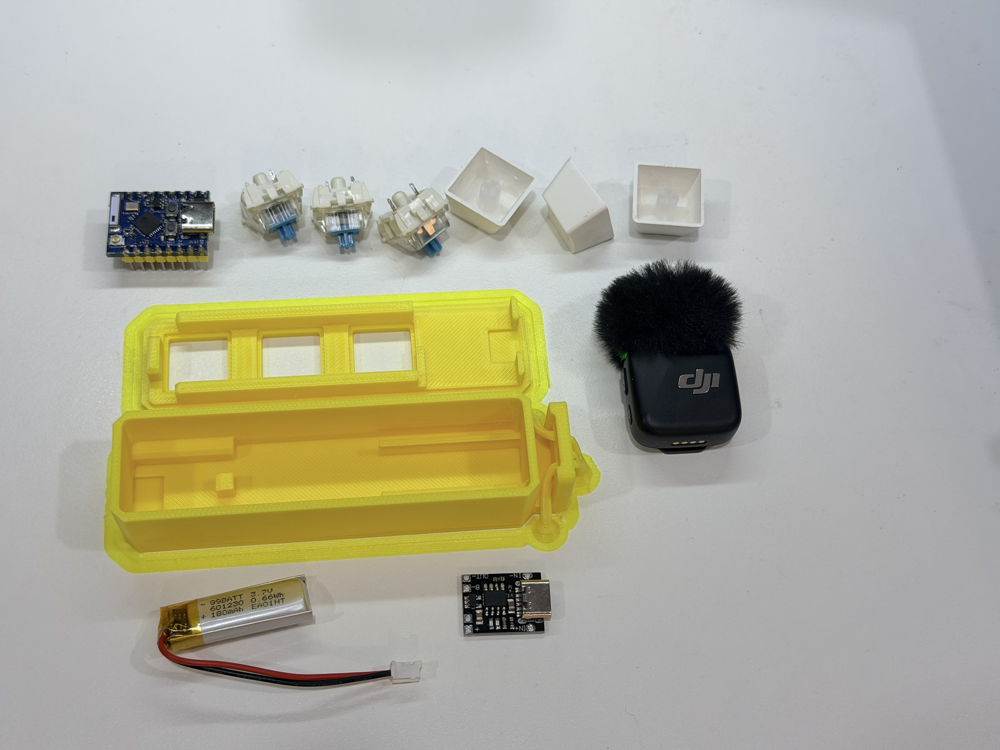
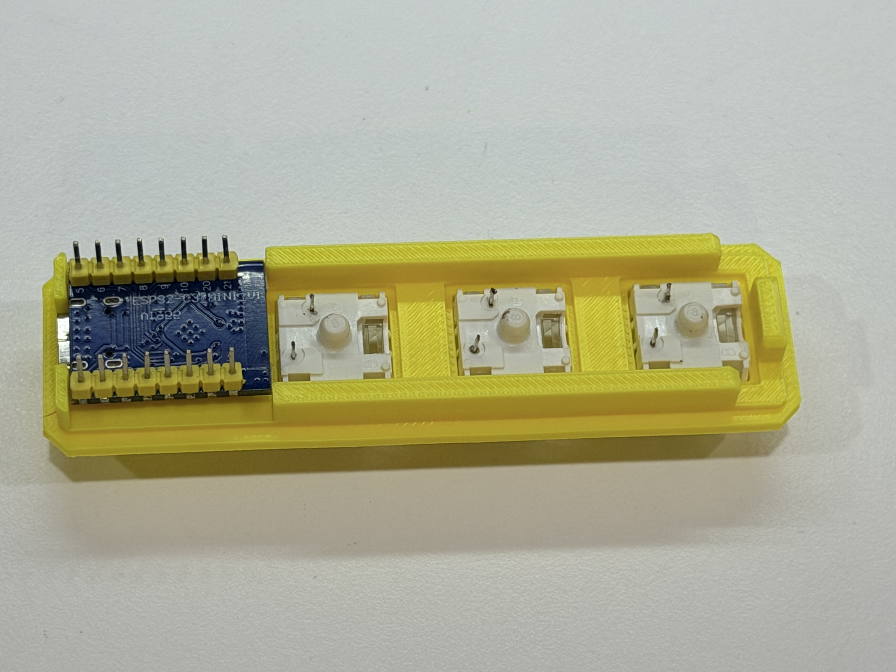
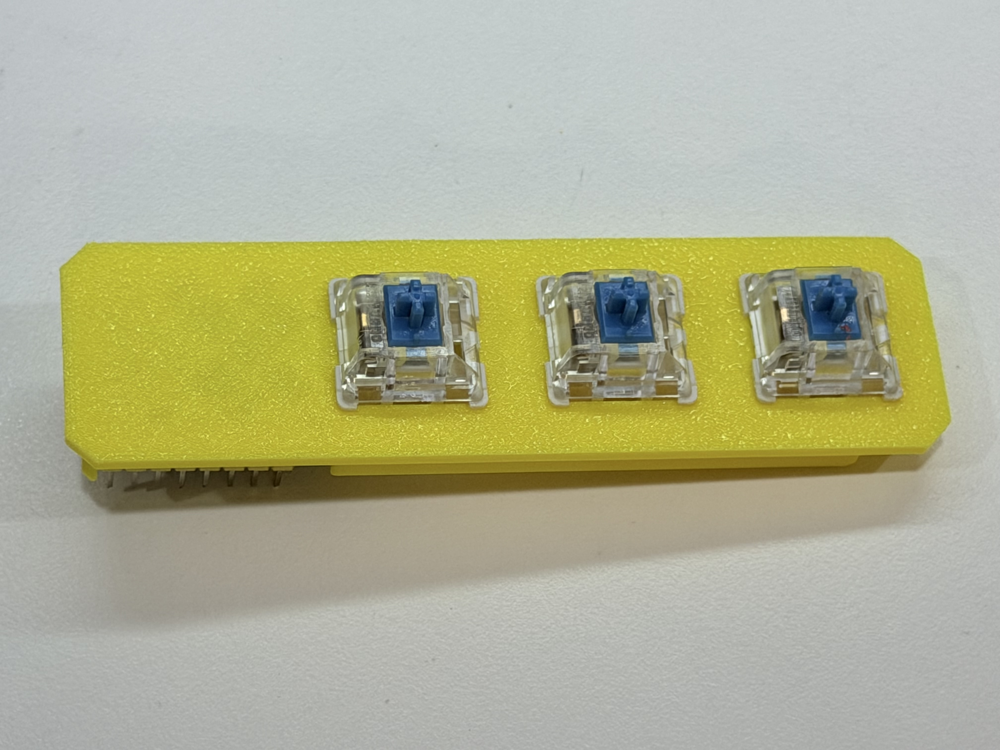
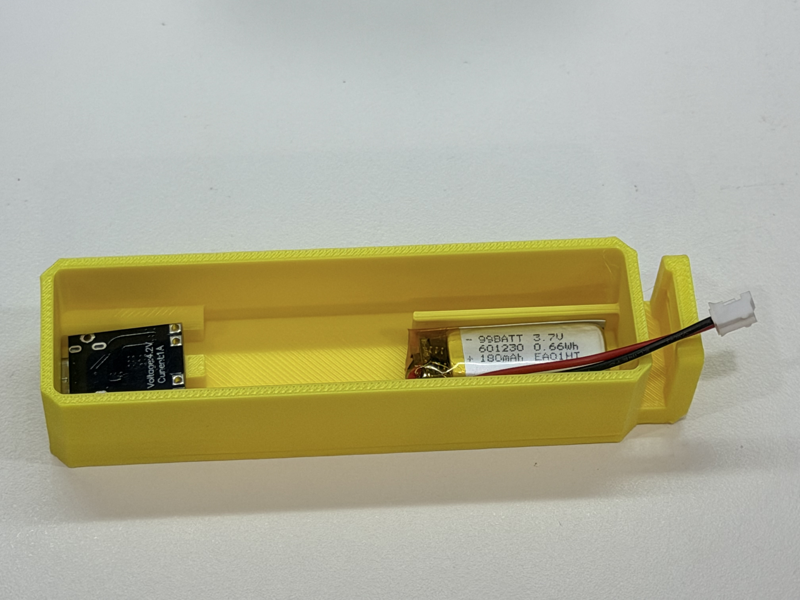
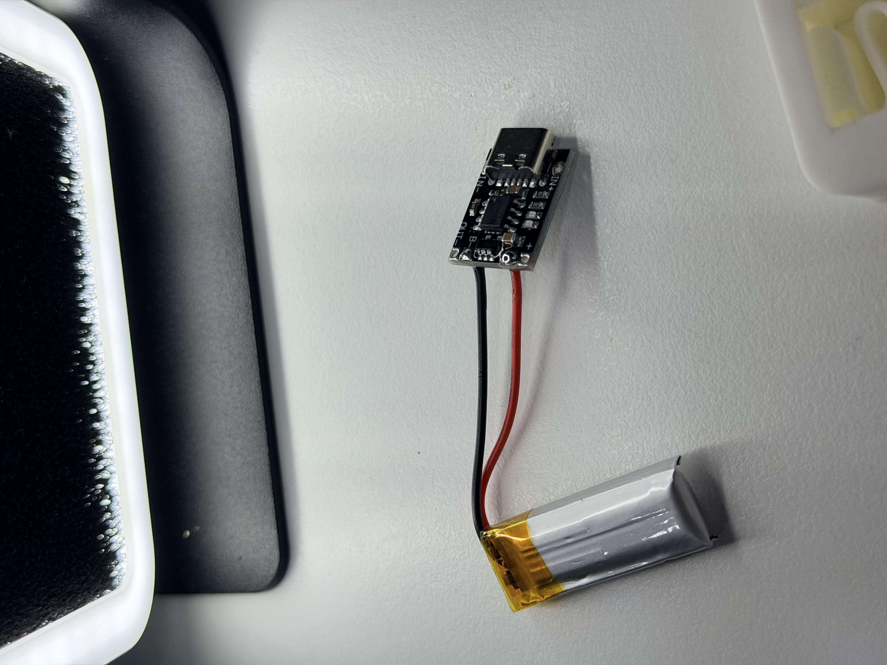
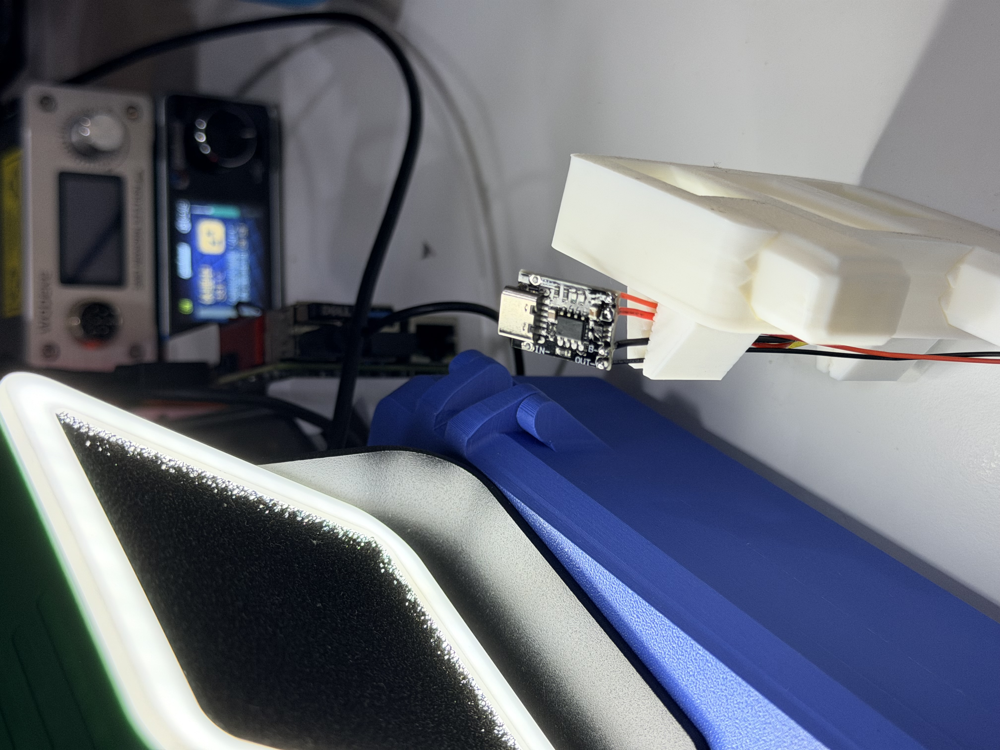
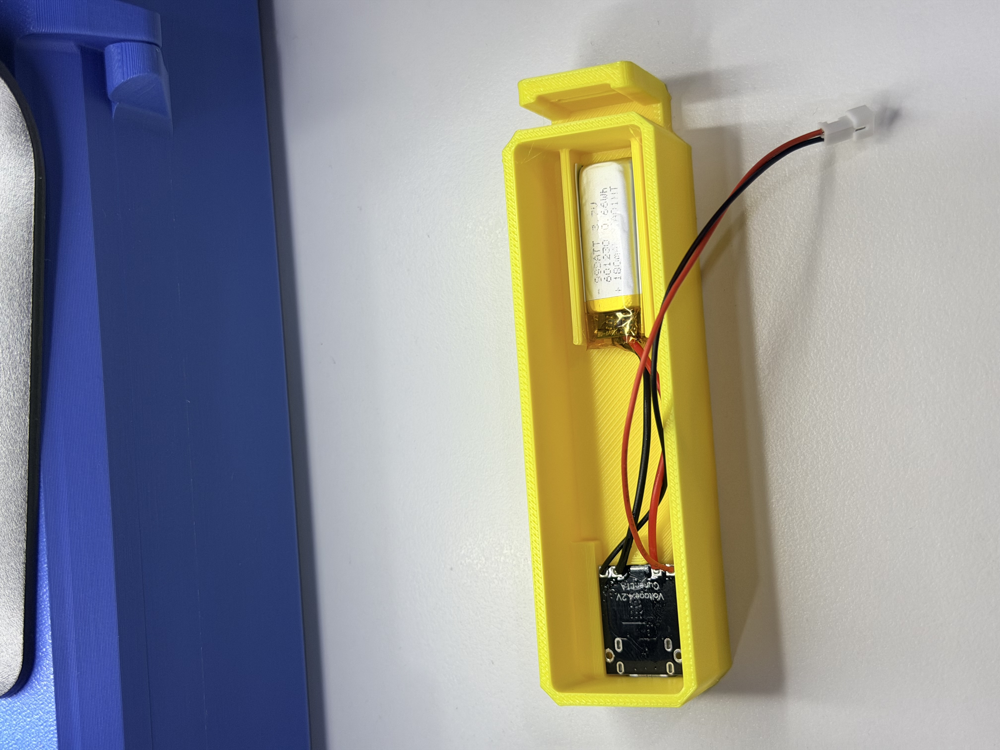
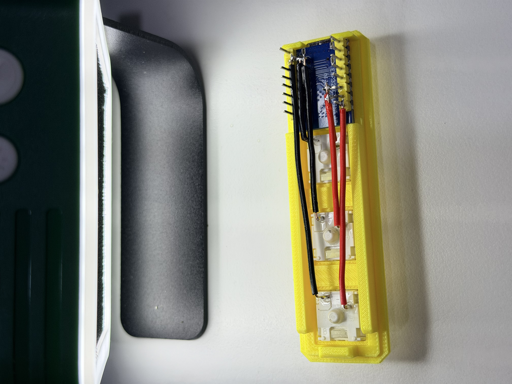
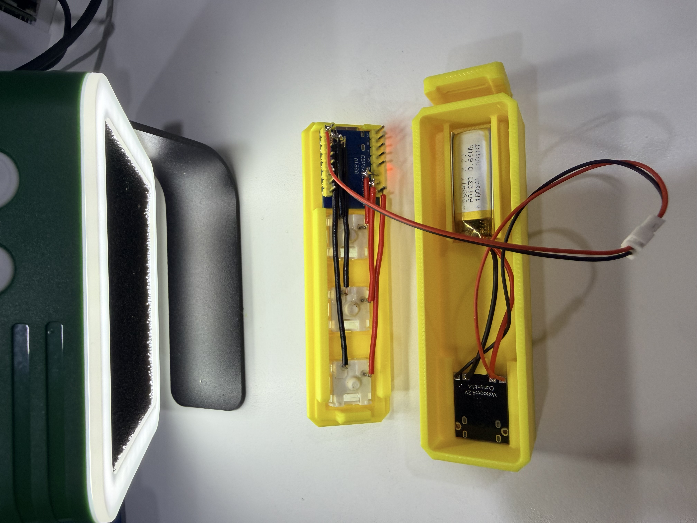

# 3-Key Wireless Macro Keyboard

**A tiny wireless keyboard for the shortcuts you use every day.**

This project turns three mechanical keys into a dedicated control surface for a desk, a workshop, or a creative setup. It combines an ESP32-C3 Mini, MX-compatible switches, a small rechargeable battery, and a two-piece 3D-printed case into a compact wireless macro pad.

The three keys can become anything: copy/paste, push-to-talk, recording, a frequently used terminal command, a media control, or a workflow trigger. The hardware is intentionally simple so the firmware and mapping can evolve with the way you work.

## What is in the build

The enclosure is split into a top cover that holds the switches and controller, and a bottom case that makes room for the battery and USB-C charging board. STEP files in the project repository make the case editable for future revisions.

| Part | Quantity | Role |
| --- | ---: | --- |
| ESP32-C3 Mini or compatible board | 1 | Wireless controller and BLE HID device |
| MX-compatible mechanical switches | 3 | Physical macro inputs |
| 1U keycaps | 3 | Example labels: `-`, `Num`, `Del` |
| 3.7 V LiPo battery, around 180 mAh | 1 | Portable power |
| USB-C LiPo charging/protection module | 1 | Charging and battery protection |
| 3D-printed top cover and bottom case | 1 each | Mechanical structure |

## From parts to a working device

Start by checking the fit of the printed parts, the controller, the charging board, and the battery. A dry fit catches clearance problems before any soldering begins.

The ESP32-C3 sits in the top cover with its USB-C connector facing the outside opening. Press the three switches into the plate and verify that every clip is seated evenly.

The top view is a small but important quality check: all three switch housings should be level and aligned before the keycaps go on.

## Power and charging

The bottom case reserves a narrow pocket for the battery and the USB-C charging module. The exact fit depends on the board and cell you choose, so measure before committing to glue or permanent mounting.

Solder the red wire to positive and the black wire to negative only after confirming the charger board markings. Keep the battery leads short, insulated, and away from sharp printed edges.

Align the charging port with the case opening before fixing the module in place. A clean alignment makes the finished pad feel like a product instead of a prototype.

Route the wires around the internal pockets so the top cover can close without pressure on the battery, solder joints, or controller.

## Wiring and firmware direction

The three switches can be wired directly to three ESP32-C3 GPIO pins. The repository currently focuses on the mechanical build; the natural next step is BLE HID firmware with a small configuration layer for key mappings.

Before closing the case, check every solder joint, confirm there are no exposed conductors that can short, and test the charging and switch inputs independently.

## Why a three-key pad is useful

A full keyboard is excellent when you need to type. A macro pad is better when you repeat the same action dozens of times. Three dedicated keys reduce the distance between intention and action: one key can start a recording, another can paste a prepared prompt, and a third can switch an application or send a status update.

For a local AI workflow, the pad can become a physical front panel for an assistant: wake the agent, capture a note, or send a predefined command without opening another window. The small form factor leaves the mapping open to experimentation.

## Firmware roadmap

- BLE HID keyboard support for the ESP32-C3
- Configurable shortcuts, media keys, and text macros
- Low-power sleep and wake behavior
- Optional battery status reporting
- A small local configuration page for remapping the three keys

## Safety notes

LiPo cells can be damaged by reversed polarity, short circuits, or incorrect charging. Confirm polarity before soldering, insulate exposed joints, and perform the first charge under supervision. Test the fit with the battery disconnected before closing the enclosure.

## Files and license

The original project includes `top_cover_20260614.step` and `bottom_case_V2_20260614.step` for the printed enclosure and is released under the MIT License.

[Open the source repository on GitHub](https://github.com/MiaoReynolds/3-key-wireless-macro-keyboard)
