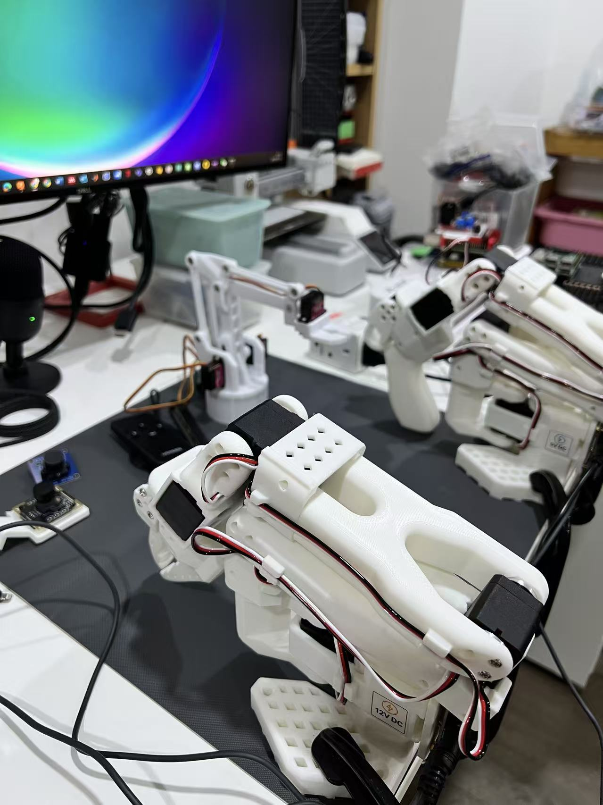
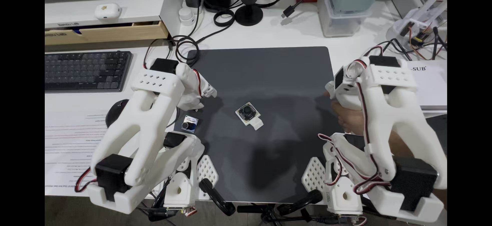
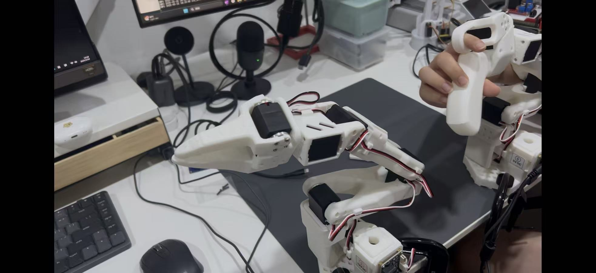
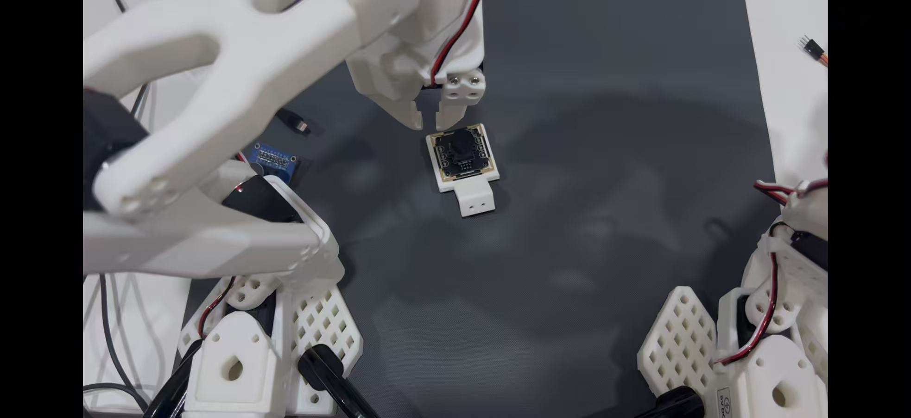

# LeRobot Arm

Robotic education platform project:

| Aspect | Details |
|--------|---------|
| Control | Master-slave logic, ESP32 control |
| Application | Teaching, interactive demos |

## Hardware Assembly & Linkage Verification

We have successfully assembled the LeRobot hardware and established the foundational control systems. Our current milestone focused on the **Master-Slave Linkage** control mechanism. 

By manually manipulating the master arm, we continuously track its joint angles and transmit this data in real-time to the slave arm. The slave arm precisely mimics the master's movements, allowing for intuitive and fluid teleoperation.

We performed several grasping verification tests, demonstrating fine-grained control over the end-effector. The linkage proves to be highly responsive, making it an excellent platform for gathering imitation learning datasets.

---

### Grasping Test

The arm dynamically adjusts to different shapes and weights during grasping tests.

---

### Master-Slave Linkage

The primary controller arm (master) and the actuated arm (slave) mirror each other in real-time.

---

### Teleoperation

Operators can easily manipulate the environment from a safe distance using the responsive master arm setup.

## Future Roadmap: Vision & Autonomy

Moving forward, our next major objective is to integrate environmental perception and autonomous capabilities.
 
- **Camera Integration:** We plan to mount a camera on the robotic setup to capture real-time visual data of the workspace.
- **Image Recognition:** Utilizing computer vision models to identify and locate target objects dynamically.
- **Autonomous Grasping:** Transitioning from pure teleoperation to AI-driven autonomous grasping, where the robot can plan its own trajectories and manipulate objects based on visual input and learned policies.
